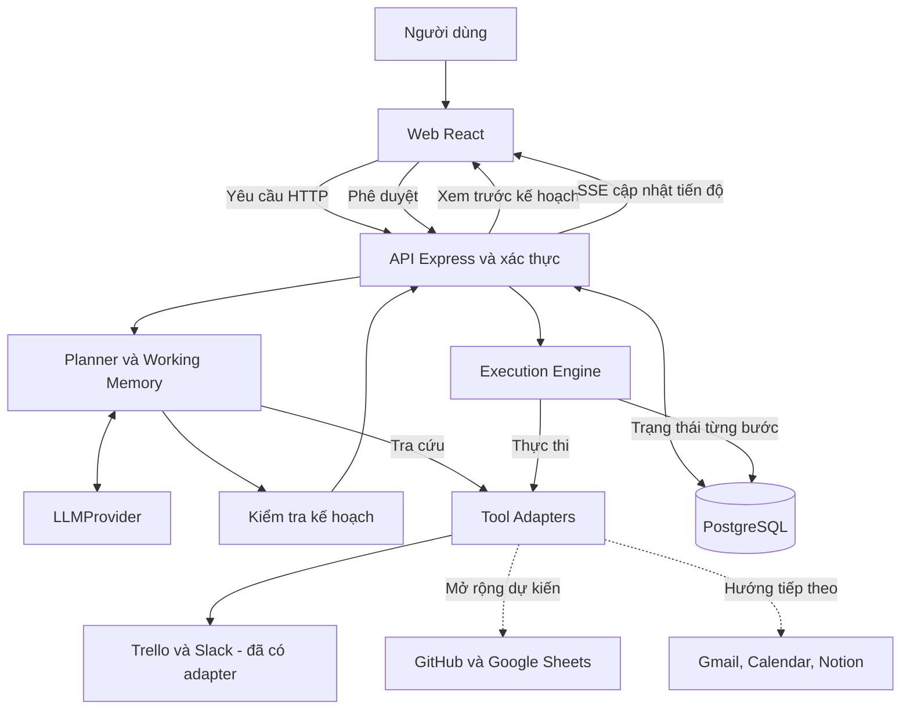
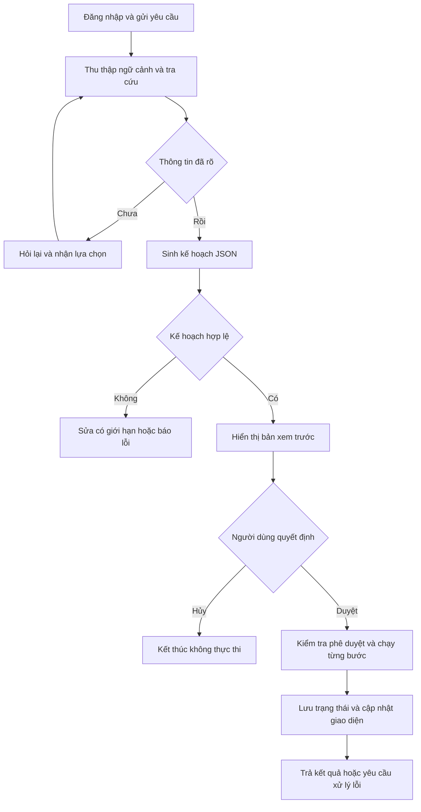

# BÁO CÁO TIẾN ĐỘ GIỮA KỲ

**Đề tài 26:** AI Workflow Automation Platform — Nền tảng tự động hóa quy trình làm việc bằng trí tuệ nhân tạo

**Môn học:** Advanced Technology Integration (ATI)

**Ngày báo cáo:** 29/09/2026

**Giai đoạn:** Phát triển và kiểm thử bản thử nghiệm v3

**Người nộp:** Nhóm trưởng

## Thông tin thành viên

| STT | Họ và tên | Mã sinh viên |
| --- | --- | --- |
| 1 | Mai Hải Yến | 2301040207 |
| 2 | Vũ Thị Loan | 2301040106 |
| 3 | Nguyễn Thành Long | 2301040109 |
| 4 | Nguyễn Đạt Vinh | 2301040198 |

## 1 Overview

Đề tài xây dựng **nền tảng AI có khả năng lập kế hoạch và thực thi workflow trên nhiều dịch vụ bên ngoài** từ yêu cầu ngôn ngữ tự nhiên. Một workflow có thể phối hợp các công cụ quản lý công việc, trao đổi nhóm, bảng tính, quản lý mã nguồn, email hoặc lịch làm việc. Người dùng mô tả mục tiêu; hệ thống lựa chọn các công cụ đã tích hợp, kết nối các bước và thực hiện sau khi được phê duyệt.

Ví dụ định hướng là tạo issue trên GitHub, ghi thông tin vào Google Sheets và thông báo trên Slack trong cùng một workflow. **Trello và Slack là hai tích hợp đầu tiên của bản thử nghiệm**, dùng để kiểm chứng cơ chế điều phối chung. GitHub và Google Sheets nằm trong lộ trình mở rộng; Gmail, Google Calendar và Notion là các hướng tiếp theo, chưa được báo cáo là chức năng đã hoàn thành.

Nhóm lựa chọn kiến trúc **Plan-then-Execute**, tức lập kế hoạch trước và thực thi sau khi được duyệt. Đến thời điểm báo cáo, các thành phần lõi và giao diện v3 đã được triển khai; luồng tích hợp trình duyệt–API–cơ sở dữ liệu đã được kiểm thử trong môi trường sandbox. Sandbox sử dụng dữ liệu và phản hồi dịch vụ được kiểm soát để kiểm tra hệ thống. Việc chạy toàn bộ quy trình với mô hình AI và dịch vụ bên ngoài thật vẫn đang ở giai đoạn chuẩn bị kiểm chứng.

## 2 Problems and objectives

### 2.1 Những vấn đề cần giải quyết

| Vấn đề | Yêu cầu đặt ra cho hệ thống |
| --- | --- |
| Một công việc cần thao tác trên nhiều ứng dụng | Kết nối các thao tác thành một quy trình có thứ tự và có thể theo dõi |
| Yêu cầu tự nhiên có thể thiếu thông tin hoặc chứa tên trùng | Thu thập ngữ cảnh, tra cứu đối tượng và hỏi lại trước khi lập kế hoạch |
| Đầu ra AI có thể sai cấu trúc, chọn sai công cụ hoặc tham số | Kiểm tra kế hoạch bằng schema, quy tắc phụ thuộc và phạm vi cho phép |
| Tạo công việc hoặc gửi thông báo làm thay đổi dữ liệu thật | Hiển thị kế hoạch, yêu cầu phê duyệt và kiểm tra quyền truy cập |
| Một bước có thể thất bại sau khi các bước trước đã hoàn tất | Lưu trạng thái từng bước, hiển thị lỗi và kiểm soát việc chạy lại |

### 2.2 Mục tiêu và phạm vi

Mục tiêu tổng quát là xây dựng nền tảng điều phối workflow liên dịch vụ, có thể bổ sung tích hợp theo cùng hợp đồng công cụ và cơ chế phê duyệt. Nhóm hướng tới các kết quả cụ thể sau:

- Cung cấp giao diện đăng nhập, hội thoại, xem trước kế hoạch và theo dõi thực thi.
- Cho phép một workflow kết hợp các công cụ từ nhiều dịch vụ đã kết nối. Catalog ban đầu có 11 công cụ Trello/Slack; bổ sung dịch vụ qua các đợt phát triển tiếp theo.
- Chứng minh khả năng mở rộng bằng một tích hợp thứ ba trong kế hoạch đề xuất sau giữa kỳ; GitHub hoặc Google Sheets là ứng viên theo đặc tả.
- Phân giải các đối tượng trên từng dịch vụ và hỏi lại khi chưa xác định rõ; bản thử nghiệm hiện xử lý board, thành viên và kênh.
- Lưu hội thoại, kế hoạch và kết quả từng bước trong PostgreSQL.
- Kiểm tra quyền sở hữu và giới hạn tài nguyên được phép trên từng dịch vụ, trước mắt là board/kênh; kế hoạch tối đa 10 bước theo thiết kế v3.
- Xây dựng kiểm thử tự động và bộ dữ liệu đánh giá chất lượng lập kế hoạch.

Phạm vi giữa kỳ tập trung vào luồng chat chủ động và cơ chế thực thi chung. Việc mở rộng dịch vụ thuộc định hướng của đề tài; mỗi dịch vụ chỉ được công nhận hỗ trợ sau khi có adapter, xác thực, kiểm soát quyền và kiểm thử tương ứng. Trình thiết kế kéo thả và lịch chạy tự động nằm ngoài phạm vi hiện tại.

Các ngưỡng dự kiến trong đặc tả gồm độ chính xác chọn công cụ ≥85%, chất lượng tham số ≥75%, tỷ lệ kế hoạch sử dụng được ≥70%, thời gian đến bản xem trước <15 giây và thời gian thực thi <15 giây trong kịch bản demo. **Đây là mục tiêu đánh giá, chưa phải kết quả đo đạt được.** Nhóm còn cần hoàn thiện tiêu chí chấm tham số, xác nhận khả năng sử dụng và phép đo thời gian trên môi trường live.

## 3 Technical approaches

### 3.1 Công nghệ và vai trò

| Thành phần | Công nghệ lựa chọn | Vai trò trong đề tài |
| --- | --- | --- |
| Giao diện | React, TypeScript, Vite, Tailwind CSS, Zustand | Hội thoại, xem trước kế hoạch, quản lý trạng thái giao diện |
| API | Node.js, Express, TypeScript | Xác thực, xử lý hội thoại, điều phối lập kế hoạch và thực thi |
| Tích hợp AI | Lớp LLMProvider và Gemini Provider qua Google Gen AI SDK | Gửi ngữ cảnh và catalog công cụ, nhận kế hoạch JSON; chưa nghiệm thu live |
| Lưu trữ | PostgreSQL | Người dùng, hội thoại, kế hoạch, trạng thái thực thi và thông tin kết nối |
| Cập nhật tiến độ | Server-Sent Events (SSE) | Đẩy sự kiện tiến độ từ máy chủ lên giao diện |
| Tích hợp dịch vụ | Hợp đồng tool và kiến trúc adapter theo dịch vụ | Chuẩn hóa lời gọi, kết quả và lỗi; hiện có adapter Trello/Slack, dự kiến bổ sung các dịch vụ khác |
| Kiểm thử và môi trường | Vitest, Playwright, Docker Compose, GitHub Actions | Kiểm thử module, luồng trình duyệt và tích hợp liên tục |

### 3.2 Phương pháp và thuật toán

**Lập kế hoạch có kiểm soát.** Nhóm sử dụng mô hình ngôn ngữ có sẵn thông qua API; phạm vi hiện tại không bao gồm huấn luyện hoặc fine-tuning mô hình. Đầu vào lập kế hoạch gồm yêu cầu, lịch sử hội thoại, ngữ cảnh đã thu thập và mô tả các công cụ. Đầu ra được chuẩn hóa thành kế hoạch JSON, câu hỏi làm rõ hoặc phản hồi từ chối.

**Định tuyến và thu thập ngữ cảnh.** Mã nguồn hiện tại dùng quy tắc từ khóa để chọn dịch vụ liên quan và các mẫu nhận diện để trích xuất tên đối tượng. Công cụ tìm kiếm trả về các ứng viên; nếu chưa xác định được đối tượng, hệ thống hỏi người dùng. Working Memory lưu các thông tin đã xác định để phục vụ bước lập kế hoạch. Cách làm này đơn giản, dễ kiểm tra, nhưng khả năng xử lý cách diễn đạt đa dạng cần tiếp tục đánh giá.

**Mở rộng tích hợp.** Mỗi dịch vụ được mô tả bằng các công cụ có schema đầu vào, đầu ra và mức rủi ro; adapter chuyển lời gọi chung thành API tương ứng. Mục tiêu là dùng lại planner và executor khi thêm dịch vụ. Mã hiện tại còn ràng buộc Trello/Slack ở định tuyến và tra cứu; cần mở rộng đăng ký công cụ, cấu hình quyền và kiểm thử, không chỉ thêm một file adapter.

**Kiểm tra cấu trúc và phụ thuộc.** Kế hoạch được kiểm tra cú pháp, schema, công cụ, tham số và các tham chiếu giữa bước. Quan hệ phụ thuộc được biểu diễn dưới dạng đồ thị có hướng không chu trình (DAG). Bộ thực thi chạy tuần tự và phân giải kết quả của bước trước qua các tham chiếu như `$ref`, `$template`. Kế hoạch không hợp lệ không được đưa vào thực thi.

**Phê duyệt và trạng thái thực thi.** Bản kế hoạch được gắn mã băm, thời hạn phê duyệt và điều kiện cập nhật trạng thái trong cơ sở dữ liệu. Bộ thực thi ghi nhận kết quả từng bước, truyền tín hiệu hủy khi quá thời gian và phân biệt lỗi đã biết với trường hợp chưa xác định được kết quả ghi (`UNKNOWN`). Thiết kế này nhằm giảm nguy cơ thực thi lặp; khả năng phục hồi sau mất kết nối hoặc khởi động lại vẫn cần kiểm thử bổ sung.

### 3.3 Các lựa chọn cần cân bằng

| Lựa chọn | Ưu điểm | Giới hạn và đánh đổi |
| --- | --- | --- |
| Lập kế hoạch rồi yêu cầu duyệt | Người dùng biết các thay đổi trước khi thực hiện | Thêm một bước tương tác; kế hoạch có thể cần lập lại khi ngữ cảnh thay đổi |
| Thực thi tuần tự | Dễ quản lý phụ thuộc, lỗi và tiến độ | Chậm hơn chạy song song khi các bước độc lập |
| Mô hình AI qua API | Giảm khối lượng huấn luyện và vận hành mô hình | Phụ thuộc tính sẵn có, độ trễ và hạn mức nhà cung cấp |
| Router dựa trên từ khóa | Dễ giải thích, ít chi phí và kiểm thử ổn định | Khó bao quát mọi cách diễn đạt; cần đánh giá trên yêu cầu đa dạng |
| Tích hợp qua hợp đồng tool và adapter | Dùng lại cơ chế lập kế hoạch, phê duyệt và thực thi | Mỗi dịch vụ vẫn cần xử lý xác thực, hạn mức, lỗi và quyền riêng |
| Sandbox trước khi chạy live | Kiểm thử lặp lại mà không tạo dữ liệu trên dịch vụ thật | Không chứng minh chất lượng AI hoặc độ ổn định của API thật |
| SSE để cập nhật tiến độ | Phù hợp với luồng sự kiện từ máy chủ đến trình duyệt | Cần quản lý kết nối lại, thứ tự và sự kiện trùng lặp |

## 4 System design

### 4.1 Kiến trúc tổng thể

Mã nguồn được tổ chức thành sáu workspace v3: `chat-web`, `chat-api`, `planner`, `executor`, `tool-schemas` và `tool-adapters`. Lớp tích hợp là điểm mở rộng để kết nối các dịch vụ bên ngoài; phần được đánh dấu dự kiến trong sơ đồ chưa phải tích hợp đã chạy. Các hợp đồng công cụ được chia sẻ giữa API, planner và executor. Phiên bản v2 được giữ làm lịch sử tham chiếu.

### 4.2 Luồng dữ liệu và suy luận

Các dịch vụ đã tích hợp chỉ nhận thao tác ghi thông qua bộ thực thi sau phê duyệt. Trong sandbox, adapter trả phản hồi được kiểm soát; trong live, adapter gọi API tương ứng. Luồng kiểm thử hiện tại chạy trình duyệt, máy chủ và PostgreSQL thật, nhưng thay thế AI và dịch vụ bên ngoài. Dịch vụ chưa có adapter và cấu hình quyền sẽ không được coi là công cụ sẵn có cho planner.

### 4.3 Thiết kế dữ liệu

| Bảng | Nội dung chính |
| --- | --- |
| `users` | Tài khoản người dùng và thông tin xác thực đã xử lý |
| `conversations` | Phiên hội thoại và liên kết tới người sở hữu |
| `messages` | Nội dung trao đổi trong từng hội thoại |
| `plans` | Kế hoạch, trạng thái, mã băm và thời hạn phê duyệt |
| `execution_steps` | Các bước thực thi, trạng thái và kết quả |
| `service_credentials` | Thông tin kết nối dịch vụ được mã hóa |

Một người dùng có nhiều hội thoại; mỗi hội thoại có nhiều tin nhắn và kế hoạch; mỗi kế hoạch có nhiều bước thực thi. Kiểm tra quyền sở hữu được thực hiện tại API khi truy cập dữ liệu theo người dùng.

## 5 Development plan

### 5.1 Các gói công việc đã triển khai

Kế hoạch kỹ thuật v3 được tổ chức thành 28 nhóm task. Đến giữa kỳ, nhóm đã có thiết kế kiến trúc, schema công cụ và dữ liệu, adapter dịch vụ, planner, executor, API, giao diện, môi trường Docker và kiểm thử tự động. Các hạng mục này đã có mã nguồn; mức kiểm chứng cụ thể được trình bày tại mục 6.

### 5.2 Kế hoạch dự kiến sau giữa kỳ

Lịch dưới đây là **ước tính bốn tuần kể từ sau báo cáo giữa kỳ**, chưa gắn với hạn nộp cuối kỳ chính thức. Một ngày công là khối lượng công việc dự kiến của một người trong một ngày; các vai trò có thể làm song song. Phân công theo tên thành viên sẽ do nhóm thống nhất.

| Thời gian | Công việc | Ước tính | Vai trò phụ trách dự kiến | Đầu ra cần đạt |
| --- | --- | --- | --- | --- |
| Tuần 1 | Rà soát cấu hình model, credentials, board/kênh thử nghiệm; chạy demo live có kiểm soát | 4–5 ngày công | AI và tích hợp | Bằng chứng yêu cầu → kế hoạch → duyệt → Trello/Slack thật |
| Tuần 2 | Kiểm thử lỗi mạng, timeout, `UNKNOWN`, chạy lại và phục hồi sau restart; sửa lỗi phát hiện | 5–6 ngày công | Backend và kiểm thử | Trạng thái bền vững, quy trình đối soát và không ghi lặp trong các ca kiểm thử |
| Tuần 3 | Đánh giá 50 yêu cầu, bổ sung nhãn tham số và thẩm định kế hoạch; đo thời gian, cải thiện prompt/router | 4–5 ngày công | AI và kiểm thử | Báo cáo chất lượng, độ trễ và các ca chưa đạt |
| Tuần 3–4 | Đề xuất thêm GitHub hoặc Google Sheets; mở rộng catalog/router, adapter, quyền và kiểm thử liên dịch vụ | 4–6 ngày công | Tích hợp và backend | Ít nhất một workflow qua ba dịch vụ; ghi rõ sandbox hoặc live |
| Tuần 4 | Hoàn thiện trải nghiệm, hướng dẫn, kịch bản demo, slide và rà soát bản phát hành | 4–5 ngày công | Frontend và cả nhóm | Bản demo tái lập được, tài liệu cuối kỳ và kết quả kiểm thử cuối |

Khối lượng dự kiến cho đợt tiếp theo là 21–27 ngày công, có công việc song song; chưa bao gồm triển khai toàn bộ các dịch vụ trong lộ trình. Lịch phụ thuộc việc truy cập dịch vụ thử nghiệm và lỗi phát hiện khi chạy live. Mốc tích hợp thứ ba là đề xuất cần chốt theo nguồn lực và hạn nộp. Các đợt sau tiếp tục mở rộng GitHub/Google Sheets, rồi xem xét Gmail, Google Calendar và Notion với cơ chế xác thực phù hợp.

## 6 Progress

### 6.1 Những phần đã thực hiện

| Hạng mục | Kết quả hiện có | Trạng thái giữa kỳ |
| --- | --- | --- |
| Phân tích và thiết kế | Đặc tả v3, kiến trúc Plan-then-Execute, kế hoạch triển khai | Đã có tài liệu |
| Hợp đồng và tích hợp | Catalog 11 công cụ; adapter Trello/Slack; kiểm soát phạm vi và chuẩn hóa lỗi | Đã có mã nguồn và kiểm thử; còn xác nhận live |
| Mở rộng đa dịch vụ | Định hướng GitHub/Google Sheets và các dịch vụ tiếp theo; mở rộng qua catalog và adapter | Đã có định hướng; chưa nghiệm thu tích hợp bổ sung trong v3 |
| Planner | Router, thu thập ngữ cảnh, hỏi lại, Working Memory và kiểm tra kế hoạch | Đã kiểm thử trong phạm vi hiện có; chưa kết luận chất lượng AI live |
| Backend và dữ liệu | API, JWT, quyền sở hữu dữ liệu, migration và sáu bảng PostgreSQL | Đã triển khai và có kiểm thử tích hợp |
| Executor | Phân giải tham chiếu, chạy từng bước, cập nhật trạng thái và xử lý lỗi | Đã triển khai; còn kiểm chứng recovery đầy đủ |
| Giao diện | Đăng nhập, chat, hỏi rõ, xem trước, duyệt/hủy và tiến độ thực thi | Đã có bốn luồng browser E2E sandbox |
| Môi trường và CI | Docker PostgreSQL riêng, hướng dẫn setup, GitHub Actions | Đã chạy CI thành công |
| Đánh giá AI | Bộ 50 golden prompts và khung đánh giá | Đã chuẩn bị; chưa hoàn tất đánh giá live độc lập |

### 6.2 Kết quả kiểm thử đã ghi nhận

Theo kết quả kiểm tra ngày 29/09/2026, bộ kiểm thử v3 đạt **199/199 bài test trong sáu workspace**. Kiểm tra TypeScript, build giao diện và smoke test khởi động đã qua. Ngoài ra, bộ bảo vệ cấu hình cơ sở dữ liệu có ba kiểm tra riêng.

Bộ kiểm thử Playwright đạt **4/4 luồng trình duyệt** trên API và PostgreSQL thật trong chế độ sandbox:

1. Đăng nhập, gửi yêu cầu, xem trước, duyệt và hoàn tất kế hoạch.
2. Hủy kế hoạch đang chờ phê duyệt.
3. Hỏi rõ khi kết quả tìm kiếm có nhiều người tên Minh, rồi tiếp tục lập kế hoạch.
4. Hiển thị lỗi validation trước khi gửi Slack và cho phép bỏ qua bước lỗi.

GitHub Actions đã chạy thành công quy trình cài đặt, migration, kiểm tra mã nguồn và browser E2E tại commit `ea89c9c`. Các số liệu trên chứng minh những hành vi được bao phủ bởi bộ kiểm thử; chưa chứng minh mọi yêu cầu tự nhiên đều được AI hiểu đúng. Trường hợp bỏ qua lỗi validation cũng chưa thay thế kiểm thử đối soát một lệnh ghi có kết quả `UNKNOWN`.

### 6.3 Công việc còn lại và đánh giá tiến độ

Nhóm đã có phần khung kỹ thuật và bản thử nghiệm tích hợp chạy trong sandbox. Bước tiếp theo là kiểm chứng live các tích hợp đầu tiên, đánh giá AI, thử nghiệm phục hồi và bổ sung dịch vụ thứ ba để chứng minh khả năng mở rộng. Định hướng sản phẩm là nền tảng workflow đa dịch vụ; Trello/Slack là phạm vi triển khai ban đầu. Bản v3 đã có pull request vào `main`, nhưng chưa hoàn tất nghiệm thu phát hành.

Vì vậy, trạng thái phù hợp tại giữa kỳ là **đã có bản thử nghiệm chức năng và bằng chứng kiểm thử sandbox; đang tiếp tục kiểm thử tích hợp thực tế và hoàn thiện sản phẩm**. Nhóm chưa tuyên bố hệ thống sẵn sàng vận hành production hoặc đã đạt các chỉ tiêu chất lượng AI đề ra.

### 6.4 Tài liệu và bằng chứng đối chiếu

- [Báo cáo kỹ thuật dự án](../PROJECT-REPORT.md).
- [Đặc tả thiết kế v3](../superpowers/specs/2026-09-29-ai-workflow-platform-v3-design.md).
- [Kế hoạch triển khai v3](../superpowers/plans/2026-09-29-ai-workflow-platform-v3.md).
- [Kết quả kiểm thử browser E2E sandbox](../audits/2026-09-29-v3-review/PHASE6-SANDBOX-BROWSER.md).
- [Hướng dẫn môi trường chạy cục bộ](../V3-LOCAL-SETUP.md).
- [GitHub Actions thành công ngày 29/09/2026](https://github.com/VinhDat267/ATI_Project/actions/runs/36548931057).
- [PR 2 về setup và browser E2E đã merge](https://github.com/VinhDat267/ATI_Project/pull/2).

Báo cáo tổng hợp kết quả của dự án, không quy đổi số lượng bài test thành phần trăm hoàn thành và không dùng dữ liệu sandbox để kết luận chất lượng AI thực tế.
