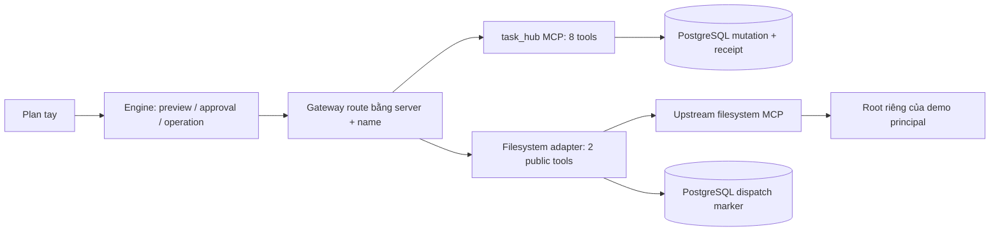

# Đợt 2 — Filesystem adapter và cổng G1

**Trạng thái: PROPOSED_FOR_IMPLEMENTATION — PLAN_ONLY.** Người dùng yêu cầu plan, chưa giao triển khai đợt 2. Tài liệu này cụ thể hóa phạm vi filesystem đã có trong B/local; không đổi phạm vi sang API/UI/AI. Không tự commit/push, cài package vào repo hoặc bật preset trong lượt viết plan.

**Nguồn chuẩn:** [BASELINE](../../BASELINE.md), [hợp đồng thực thi](../../EXECUTION-CONTRACT.md), [kế hoạch 6 tuần](../../KE-HOACH-6-TUAN.md), [TH-07 review](../../task-hub-evidence/batch-01/review-TH-07-20260913/README.md). [Baseline bàn giao](../../antigravity/filesystem-handoff-baseline.json) ghi hash thực của 56 source/config/test files và 180 file cần bảo toàn.

## 1. Hiện trạng đã đọc

| Hiện trạng | Hệ quả cho đợt 2 |
|---|---|
| `Gateway.call(name, args, auth, timeout, context)` chưa có server | Phải route bằng cặp `(server, name)`; không thêm fallback theo tên. |
| `ToolSchema.server` đang literal `task_hub` | Mở đúng hai server, giữ parser đọc snapshot v1 cũ. |
| `prepare.ts` ghi mọi operation là `local_transaction` | Chọn receiver mode từ policy tin cậy, không từ DSL hoặc annotation. |
| `attempts.ts` yêu cầu hub receipt cho mọi write thành công | Giữ nguyên kiểm receipt cho task_hub; filesystem có nhánh xác nhận riêng. |
| `reconcile` join `hub_receipts` cho tất cả operation | Giới hạn đối chiếu receipt vào task_hub; filesystem không được suy ra confirmed từ file hiện tại. |
| Các wrapper test so sánh `args[0]` với tên tool | Chuyển cơ học sang target.server/target.name; giữ đủ 142 test cũ. |
| Preset deny-all; filesystem catalog SPEC_ONLY | Không launch filesystem cho CLI mặc định trước khi có config/policy được kiểm. |

142 test là kết quả TH-07 trước lượt viết plan: 39 DSL unit + 63 MCP/DB + 40 engine. Không chạy lại runtime trong lượt này, không xem số đó là kết quả triển khai filesystem.

## 2. Quyết định kiến trúc

Ba hướng đã cân nhắc:

1. **Chọn: adapter trong engine, nối upstream filesystem bằng MCP stdio.** Ít thành phần mới, giữ package đã pin, có hai server MCP thật. Bổ sung root policy, normalization và dispatch guard riêng cho filesystem.
2. Tự viết thêm filesystem MCP server và receiver receipt: nhiều mã bảo mật và bài toán atomic DB/file hơn mức cần cho G1; chưa chọn.
3. Chạy filesystem trong container/VM với mount riêng: cách phù hợp hơn nếu cần chống tiến trình local độc hại; tăng đóng gói và kiểm thử Windows/Docker. Giữ là điều kiện nâng cấp nếu threat model thay đổi, không tuyên bố adapter Node là OS sandbox.

Hai process MCP: task_hub và upstream filesystem. Adapter là mã trong engine, không phải server thứ ba. Upstream có thêm tool; chỉ hai tool được publish cho DSL. Không dùng list count của upstream làm số tool public.

## 3. Package và provenance

Đã tải và đọc tarball npm **mà không cài hoặc thực thi**:

- `@modelcontextprotocol/server-filesystem@2026.8.31`.
- Integrity: `sha512-kKaFkyAh6oipvc9+EAbJ552JafnMnOq5nzmzWkp1jJdBhTAAGpmIpWihUG1+rfNhmEFM98gUZDdCHCDD4v6a7Q==`.
- Entry `dist/index.js`; server info trong artifact là `secure-filesystem-server` / `0.2.0`, khác npm package version.
- Raw `read_text_file` trả `structuredContent: { content: string }`.
- Raw `write_file` trả acknowledgement `Successfully wrote to ${args.path}` trong `structuredContent.content`; không có operation receipt.

[Metadata npm của bản pin](https://registry.npmjs.org/@modelcontextprotocol/server-filesystem/2026.8.31) và checksum từng file nằm trong baseline bàn giao. [README upstream](https://raw.githubusercontent.com/modelcontextprotocol/servers/main/src/filesystem/README.md) mô tả read/write và cơ chế roots; nhánh main chỉ để tham khảo, artifact pin và live discovery khi FS-01 chạy mới là nguồn kiểm phiên bản triển khai. Không dùng `npx -y ...@latest`. Không advertise capability roots hay gửi roots/list_changed: root được cố định từ launcher đã kiểm.

## 4. Hợp đồng public, policy, giới hạn

Giữ hình dạng hai schema filesystem hiện có trong `testdata/tools.json`; chỉ nâng policy filesystem từ SPEC_ONLY `b-local-1` sang **`b-local-fs-1`** khi đã kiểm. Tám schema/policy task_hub giữ nguyên.

| Public tool | Args | Normalized output | Upstream |
|---|---|---|---|
| `filesystem.read_file` | `{path: string}` strict | `{text: string}` strict | `read_text_file({path: absolutePath})` |
| `filesystem.write_file` | `{path: string, content: string}` strict | `{path: originalRelativePath}` strict | `write_file({path: absolutePath, content})` |

Runtime policy giới hạn chặt hơn shape-only schema đã có:

- Text UTF-8, tối đa **65,536 bytes** cho mỗi nội dung đọc/ghi; text rỗng hợp lệ. Bảo toàn newline và BOM; không trim, normalize hay tự stringify object.
- Từ chối UTF-8 lỗi, NUL trong text và surrogate không ghép cặp trong JS string. Không hỗ trợ binary, base64, ảnh, encoding khác, head/tail, append, mkdir, move/delete/search.
- Path tối đa **1,024 UTF-16 code units**, slash `/` phân tách; chỉ path tương đối, ít nhất một segment. Segment gồm chữ Unicode/số, dấu cách nội bộ, `_`, `-`, `.`; không bắt đầu bằng `.`, không kết thúc bằng dấu chấm hoặc dấu cách.
- Từ chối `.`/`..`, segment rỗng, backslash, colon/ADS, NUL/control chars, absolute/UNC/device/drive-relative paths, ký tự `%`, wildcard và tên thiết bị Windows (`CON`, `PRN`, `AUX`, `NUL`, `COM1..9`, `LPT1..9` kể cả extension; gồm biến thể superscript ¹²³). Không URL-decode hay mở rộng `~`/biến môi trường.
- Không cho upstream tự chuyển một tên mới sang file Unicode-equivalent đã có: khi leaf chưa tồn tại, đọc directory entries và từ chối nếu có tên khác nhưng cùng NFC (NFD/NFC alias). So sánh để từ chối, không sửa spelling của approved args.
- `read_file` cần regular file đã có. `write_file` tạo hoặc thay nội dung regular file; parent phải có sẵn. Không tự tạo parent. Existing file bị replace theo nội dung đã duyệt; không có compare-and-swap với bản file trước preview.
- Từ chối symlink, junction, dangling link, reparse/special file quan sát được, hardlink `nlink > 1`, và root không phải directory thường. Kiểm từng component bằng lstat/realpath, không dùng startsWith đơn thuần. Root và target thật phải cùng quan hệ containment sau canonicalization.

**Threat model G1:** root demo riêng do ứng dụng quản lý, không chứa dữ liệu người dùng khác; không có tiến trình local không tin cậy được quyền đổi cây root đồng thời. Node preflight + upstream realpath không chứng minh miễn nhiễm mọi TOCTOU trước một tiến trình cùng quyền OS. Test static link/junction/traversal là bắt buộc. Nếu yêu cầu chống actor local độc hại xuất hiện, ghi BLOCKED cho claim đó và thiết kế OS isolation trước khi bật, không giảm test hoặc gọi đây là sandbox.

Read được preflight bằng bounded OS read tối đa 65,537 bytes để kiểm encoding/size; kết quả nghiệp vụ vẫn phải đến từ MCP thật và khớp bytes preflight. Sai khác do file đổi giữa hai lần đọc -> read failure, không trả thành công. Đây là validation adapter, không mock MCP. Giới hạn bộ nhớ dưới đối thủ local cố tình grow file không nằm trong threat model vừa nêu.

## 5. Root, principal và launch

- Root CLI: `<project>/runtime/filesystem/<G1_USER_ID>`; UUID principal đã parse. Parent `runtime/filesystem` và root không là link. Không có root bằng project, drive, home, Downloads hoặc vị trí chứa credential.
- Script setup demo chỉ tạo root này, `reports/`, `notes.txt` với nội dung tổng hợp. Dùng exclusive create, giữ mọi file đã có. Tạo `.ati-root.json` strict object `{format:"ati-filesystem-root-1",root_id:UUID,user_id:UUID}`; user_id phải bằng principal launcher; tool path policy chặn đọc/ghi marker đó.
- CLI mặc định chỉ task_hub. `G1_FILESYSTEM_ENABLED=1` mới yêu cầu preset hợp lệ; thiếu root/preset/artifact -> lỗi CONFIG, không tự downgrade về tám tools.
- Preset checked-in chứa entry/package/version/integrity/policy/root strategy, không chứa secret, không cho DSL chọn executable/args/env/root. Tests được truyền root tạm bằng trusted API, không bằng tool args hoặc production env bypass.
- Băm launcher identity, node executable/version, preset/config, catalog, adapter/engine build, upstream package và dependency runtime closure thực tế. Root binding gồm principal, canonical path, root marker ID và stat dev/ino khi khả dụng. Không băm nội dung user files vào artifact: read snapshots đã lưu dữ liệu cần giữ.
- Snapshot thay root/config/package/schema/policy phải bị từ chối trước write; tạo run/approval mới. Đóng mọi client đã mở khi startup lỗi, đóng cả hai khi worker mất lock. Không log env/database URL chứa credential.

## 6. Receiver mode, approval, dispatch marker

Mapping tin cậy là bảng đóng trong engine:

| Server/tool | Receiver mode |
|---|---|
| task_hub append/send/create/move, policy b-local-1 | `local_transaction` |
| filesystem write_file, policy b-local-fs-1 | `non_idempotent` |
| Read hoặc tổ hợp không được biết | Không cấp write mode; từ chối nếu cố dùng làm write |

Không thêm default field vào snapshot cũ: ToolSchema cho hai server, shape còn lại giữ nguyên; receiver mode suy từ server/name/policy và lưu trong tool_operations. Mismatch DB mode với trusted policy -> conflict. Snapshot `b-local-preview-1` cũ vẫn parse/canonicalize nguyên bytes; không tự viết lại lịch sử. Build/artifact đổi có thể làm preview cũ không còn execute được, nhưng detail/trace/reconcile vẫn đọc được.

Filesystem adapter có guard trước outbound write:

1. Validate path/content/root/artifact trước khi có side effect.
2. Trong transaction khóa run -> approval -> operation, kiểm owner, running, đã claim, không cancel, approved, version/hash/TTL, snapshot bytes/tool artifacts/actions, operation in_flight, receiver mode và payload đúng. Dùng `Store`, `verifyPreview`, `payloadHash` hiện có; không bịa hàm receiver khác.
3. Insert `filesystem_dispatches` duy nhất theo operation_id; commit trước gọi upstream. Row chỉ là **dispatch marker**, không có result, không là receipt. Operation đã có marker không được dispatch lại, kể cả không rõ packet cũ đã tới server chưa.
4. Recheck worker/approval expiry/cancel/artifact/root ngay trước outbound call. Không packet nếu check thất bại. Một write đã dispatch có thể hoàn tất sau expiry/cancel; không hứa rollback file như transaction PostgreSQL.
5. Gọi raw MCP đúng một lần. Chỉ xác nhận thành công khi acknowledgement đúng exact pinned mapping và bounded OS read-back đúng bytes cần ghi. Trả `{path}` từ resolved approved args, không parse path tùy ý từ message.

Marker chống gửi lặp từ adapter/gateway; nó không tạo atomicity giữa DB và filesystem. Crash sau marker nhưng trước packet vẫn conservative unknown. Không tự xóa marker để retry. Không ghi fake hub receipt, không dùng content hash như idempotency receipt.

## 7. Certainty và reconcile

| Trường hợp | Kết quả engine |
|---|---|
| Validation/root/auth fail chắc chắn trước outbound | `before_dispatch`, known_failed, không raw call |
| Task_hub write trả schema hợp lệ + receipt đối chiếu khớp | confirmed như hiện hành |
| Filesystem write có ack hợp lệ + read-back bytes khớp | confirmed; `non_idempotent`, không có hub receipt |
| Filesystem transport timeout, isError, output lỗi, mất reply, read-back thất bại sau dispatch | unknown, reconciliation_required, không retry |
| Crash/recover sau filesystem dispatch | unknown được giữ; không dispatch lại |
| Filesystem marker đã tồn tại | Không call lại; unknown/already_dispatched, không hạ xuống known_not_applied |

Sửa catch trong attempts: chỉ `BeforeDispatchError` chứng minh trước dispatch. Không coi mọi `EngineError` là before_dispatch. `knownToolError` chỉ dùng với task_hub đã được review; không tin text/error code do upstream filesystem trả để kết luận write chưa xảy ra.

`reconcile` cho filesystem trả `receiver_mode: non_idempotent`, `receipt: not_supported`, `result: null`, state đang lưu và marker present/absent. Không đọc file để nâng outcome thành confirmed; không đổi trace/state hay tự hoàn thành bước còn lại. Task_hub reconcile giữ confirmed/conflict/not_observed và receipt verification như cũ. Query join hub_receipts phải có điều kiện server/mode để không nhận nhầm row.

## 8. G1 được đóng ở mức nào

**Technical G1 PASS** chỉ khi có đủ: artifact/launch pinned; 8+2 public tools qua hai server thật; confinement và normalization; demo đọc -> một preview -> approve -> ghi thật -> trace; task_hub write có receipt, filesystem non-idempotent có marker và fault evidence; migration/seed preserving; nguyên bộ regression cũ; output oracle chính xác; không xóa skip/failure; teardown DB/root test; nguồn rubric và gaps công khai.

**G1 overall PASS** còn cần rubric chính thức và đối chiếu mục G1, cùng xác nhận một mẫu việc thật của nhóm. Thiếu rubric -> `TECHNICAL_PASS_OVERALL_PARTIAL`; rubric có tiêu chí chưa đạt -> `PARTIAL_WITH_GAPS`. Không biến điểm tự đặt của team thành rubric giảng viên. Phần AI/course evaluation ngoài G1 được map vào đợt sau, không yêu cầu implement AI để kết thúc filesystem.

## 9. Giới hạn và deliverables

- Không API/session/UI/polling/BullMQ/AI/replan mới; không thêm DSL loop/map/write-output references.
- Không auto-commit/push, worktree bỏ mất thay đổi uncommitted, demo reset, seed vào DB thật cho mục đích test.
- Bảo toàn migration 0001–0004 và toàn bộ evidence trước đợt 2. Chỉ migration mới 0005 cho dispatch marker được đề xuất.
- Dataset 10 case/6 dev/4 holdout giữ nguyên; thêm plan tay dev riêng dưới `testdata/dev-hand-plans/`. Không gọi chúng là AI evaluation hoặc tăng denominator thí nghiệm.
- Output: implementation theo FS-01..FS-06, báo cáo từng task, live raw discovery + normalized schemas, fault traces, manifest final, rubric mapping, manual demo có JSON field đúng.

Thực thi theo [plan chi tiết](../plans/2026-09-13-filesystem-g1-completion.md), một task/lần; mỗi task được giao riêng mới là authorization triển khai.
