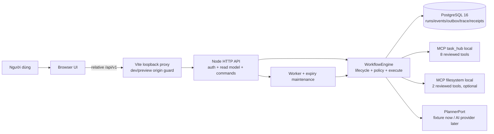
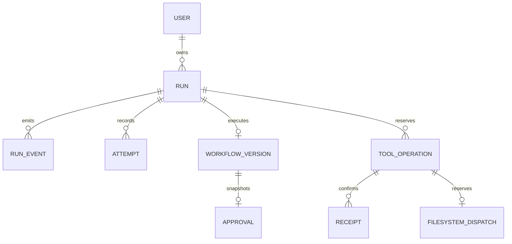
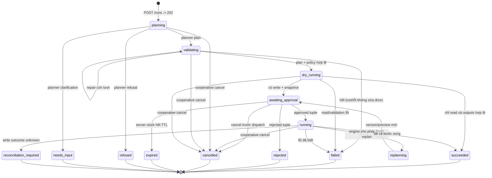
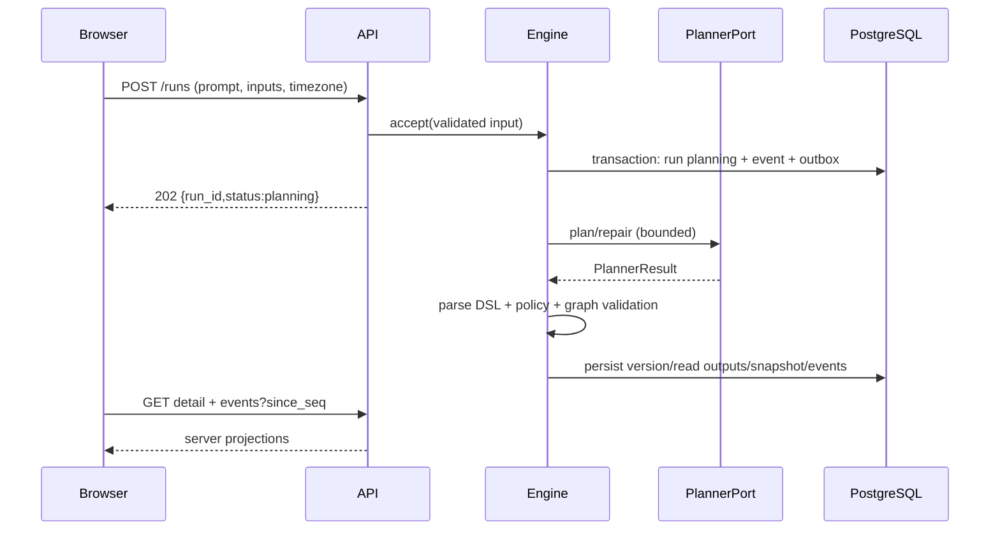

# System design — AI Workflow Automation Platform B/local

Ngày: 15/09/2026
Trạng thái: **DRAFT_FOR_REVIEW**
Phạm vi: cấu hình **B/local** đã chốt trong `docs/BASELINE.md`

Tài liệu này là thiết kế hệ thống, không phải wireframe, ADR chọn thư viện hay kế hoạch chia task. Nó nối các hợp đồng hiện có thành một kiến trúc có nguồn sự thật, seam, luồng dữ liệu và cách xử lý lỗi rõ ràng. `docs/superpowers/specs/2026-09-15-platform-ux-design.md` mô tả tổ chức UX; `docs/ADR-001-FRONTEND-STACK.md` ghi quyết định renderer; `docs/EXECUTION-CONTRACT.md` ghi bất biến thực thi. Không tài liệu nào trong ba tài liệu đó một mình là system design.

## 0. Cổng phát triển

WEB-01B (`23a41d8`) đã tạo shell React, session, navigation và fixture adapter trước khi system design được chốt. Commit đó giữ nguyên để bảo toàn lịch sử và có thể đảo ngược; trạng thái của nó là **PROVISIONAL_IMPLEMENTATION**, chưa phải bằng chứng frontend đã tích hợp hệ thống.

Không bắt đầu WEB-01C, WEB-02 hoặc thêm view/interaction mới cho tới khi tài liệu này được review và chuyển sang `APPROVED_FOR_IMPLEMENTATION`. Sau khi được duyệt, phải audit WEB-01B theo các seam và invariant bên dưới; phần nào không khớp sẽ được sửa bằng task riêng.

## 1. Mục tiêu và giới hạn

Mục tiêu của hệ thống là nhận một yêu cầu tự nhiên, tạo một plan DSL có thể giải thích, kiểm tra plan và policy, chạy dry-run cho các bước đọc, cho người dùng xem snapshot, yêu cầu duyệt đúng snapshot trước thao tác ghi, thực thi tuần tự có kiểm soát, rồi xuất kết quả, trace và thông tin đối chiếu khi kết quả ghi chưa rõ.

B/local có một principal demo, chạy loopback, PostgreSQL 16, một worker tuần tự và tối đa 10 capability local đã review: 8 tool `task_hub` và 2 tool `filesystem` tùy chọn. Tên Sheets/Slack/Cards chỉ là dữ liệu local trong prototype. Planner hiện có `dev_fixture`/`disabled`; điều đó đủ để kiểm vòng đời nhưng chưa phải bằng chứng chất lượng AI.

Không thuộc thiết kế này: multi-tenant production, đăng ký tài khoản, credential vault, SaaS thật, GitHub, workflow editor/library, lịch chạy định kỳ, WebSocket, thực thi song song, automatic resume, blind retry write, hay quyền chạy executable tùy ý từ trình duyệt.

## 2. Nguyên tắc kiến trúc

1. **Server là authority của run.** Status, event sequence, approval, TTL, owner, version và snapshot đều lấy từ server; UI không tự suy ra trạng thái kế tiếp.
2. **Write luôn có hai bước.** Preview bất biến và decision đúng tuple phải hoàn tất trước dispatch. `reconciliation_required` là kết quả hợp lệ khi receiver chưa chứng minh được side-effect.
3. **Một nguồn sự thật cho mỗi loại dữ liệu.** DSL ở `packages/dsl/src`; schema SQL ở `db/migrations`; lifecycle/approval/execute ở engine; HTTP chỉ chuyển đổi contract; React chỉ render snapshot và phát command.
4. **Seam nhỏ, module sâu.** Mỗi module trình bày một interface nhỏ, che phần retry, lock, parsing, redaction hoặc state transition bên trong. Adapter cụ thể thay đổi được tại seam mà không kéo chi tiết implementation vào caller.
5. **Fail closed.** Thiếu catalog/policy/owner/hash/schema hoặc không xác định được kết quả thì không dispatch write và không nâng verdict từ fixture/static check lên live pass.
6. **Không trộn trạng thái tin cậy và trạng thái hiển thị.** URL chỉ chứa route và `runId`; token chỉ ở memory; dữ liệu protected được xóa khi session generation đổi; fixture luôn có nhãn.

## 3. Context view



Các mũi tên từ browser chỉ đi tới HTTP API. Browser không mở PostgreSQL, MCP stdio, filesystem hay planner. Vite proxy chỉ phục vụ local development/preview; nó không phải production gateway và không được nhận target từ người dùng.

## 4. Container view và trách nhiệm

| Container/module | Trách nhiệm | Nguồn sự thật | Không được làm |
|---|---|---|---|
| Browser application | Render sáu view, giữ UI state tạm, gửi command qua `Transport` | HTTP response/event snapshot | Không tự đổi run status, không lưu token, không gọi DB/MCP |
| Vite proxy | Chấp nhận đúng loopback Host/Origin, chuyển `/api/v1` tới API | server config | Không expose `WAP_API_TARGET`, không tạo route fixture/DB |
| API HTTP | Auth, parse JSON, owner check, map lỗi, gọi engine, tạo request id | API Zod contracts | Không chứa business transition hoặc gọi MCP trực tiếp |
| SessionStore (API) | Xác thực bearer memory-only, throttle login, TTL | Server memory + principal DB check | Không ghi password/token vào log hoặc DB |
| WorkflowEngine | Accept, plan, validate, dry-run, approval, execute, cancel, recovery, reconcile | PostgreSQL + DSL/policy | Không để UI/LLM cấp quyền write |
| PlannerPort adapter | Trả `PlannerResult` plan/refusal/clarification và repair có giới hạn | Planner provider/fixture | Không lưu token, không dispatch tool |
| Gateway adapters | Catalog đã review, schema/policy check, MCP call, redaction | Built artifact + policy fingerprint | Không tin raw `tools/list`, không nhận executable từ plan |
| PostgreSQL | Transactional state, event seq, outbox, snapshot, attempts, receipts | SQL migrations | Không được reset dữ liệu demo trong test integration |
| MCP receivers | Đọc/ghi dữ liệu local theo schema và authorization | Receiver DB/filesystem | Không tự bypass approval; filesystem marker không phải receipt |
| Worker/maintenance | Claim outbox tuần tự, expiry, orphan recovery khi được gọi | Engine + advisory lock | Không tự resume unknown write hoặc chạy song song |

### 4.1. Các module sâu và seam chính

* `WorkflowEngine` là module sâu ở seam giữa API/CLI và lifecycle. Interface tối thiểu cần bao phủ `accept`, `detail`, `list`, `events`, `tracePage`, `decide`, `cancel`, `execute`, `reconcile`, `serverSummaries` và `serverCatalog`; caller không biết SQL transaction, advisory lock hay MCP packet.
* `PlannerPort` là seam giữa engine và planner. `dev_fixture` và provider AI tương lai là hai adapter khác nhau; engine chỉ nhận `PlannerResultSchema` và áp cùng giới hạn repair.
* `Gateway` là seam giữa engine và receiver. `task_hub` và `filesystem` khác certainty/receipt semantics nhưng cùng interface dispatch đã kiểm policy.
* `Transport` là seam giữa frontend core và HTTP/fixture. React không import `fetch`, Zod parsing cấp thấp hay fixture data.
* `RunState`/event ingestor là module sâu giữa transport và view. Nó kiểm `seq`, merge snapshot, terminal fence, generation và stale response; view chỉ nhận immutable projection.

## 5. Domain model và quyền sở hữu dữ liệu



| Khái niệm | Chủ sở hữu | Bất biến quan trọng |
|---|---|---|
| `Run` | Engine/store | owner, status, `last_seq`, source prompt, runtime/timezone; terminal không chuyển tiếp |
| `WorkflowVersion` | Engine/store | plan đã validate, tool/policy snapshot và version id; không sửa tại chỗ |
| `Approval` | Engine/transaction | run + owner + version + snapshot hash + expiry + decision; decision kiểm nguyên tử |
| `RunEvent` | Engine/store | seq tăng strictly, append cùng status/outbox; sau `run.finished` không thêm event |
| `Attempt` | Engine/trace | snapshot tool/args/result/certainty; attempt đã kết thúc không bị ghi đè |
| `ToolOperation` | Engine/store | operation id ổn định cho một ý định write, payload hash, receiver mode |
| `Receipt` | Receiver transaction | mutation và receipt cùng transaction cho `task_hub`; không suy rộng cho filesystem |
| `FilesystemDispatch` | Filesystem adapter | marker reservation trước packet; không chứng minh bytes đã ghi |
| Browser session | Frontend session module | token trong memory, generation tăng khi login/logout/expiry |
| API session | `SessionStore` | token TTL memory-only, owner là principal cấu hình; không có revoke endpoint production |

## 6. Lifecycle và state authority



14 status hiện hành là `planning`, `validating`, `dry_running`, `awaiting_approval`, `running`, `replanning`, `succeeded`, `failed`, `rejected`, `cancelled`, `expired`, `refused`, `needs_input`, `reconciliation_required`. Terminal status chỉ kết thúc bằng `run.finished`; UI không tạo status thứ 15 và không biến `reconciliation_required` thành failed/succeeded.

## 7. Luồng dữ liệu chính

### 7.1. Login và session

1. Browser gửi `POST /api/v1/auth/login` với JSON đã validate.
2. API kiểm password hash, throttle và principal; trả bearer token cùng `request_id`.
3. Frontend giữ token trong `SessionController`, tăng generation và điều hướng tới route hợp lệ.
4. Mỗi request tạo `AbortController` gắn generation. Logout/401/expiry abort request cũ, xóa protected projection và không cho response cũ ghi vào session mới.
5. Reload không khôi phục token; người dùng đăng nhập lại. URL chỉ giữ route/run id, không giữ prompt/credential.

### 7.2. Tạo run đến preview



Planner refusal/clarification kết thúc run mà không tạo executable version, approval hoặc write. `dryrun.ready` chỉ là tín hiệu để lấy detail; UI không dựng payload từ event preview rút gọn.

### 7.3. Poll và reconnect

* Run detail là snapshot tham khảo; event cursor là `last_ingested_seq` của frontend, không phải `RunDetail.last_seq` chưa đọc.
* Chỉ có một poll request trong flight cho một run. Gửi `since_seq` hiện tại, chỉ merge page nếu mọi event có seq tăng strict và response parse thành công.
* Empty page giữ cursor. Mất mạng giữ projection cuối cùng với nhãn stale, không đổi status thành failed.
* Khi detail đã terminal nhưng chưa thấy `run.finished`, drain tiếp tới event cuối. Sau terminal không poll vô hạn.
* Generation/session/run id được kiểm trước khi commit response; response cũ bị bỏ qua.

### 7.4. Approval và write

1. View chỉ bật đúng hai action khi `approval.status=pending`, TTL server còn hiệu lực và có đủ `approval_id`, `workflow_version_id`, `snapshot_hash`.
2. Click lần đầu khóa action và gửi một POST. Click thứ hai không tạo request thứ hai.
3. API/engine lock run + approval, kiểm owner/status/version/hash/expiry và cập nhật decision, event, outbox trong cùng transaction.
4. `409` hoặc mất response không được tự đổi tuple hay retry mù; frontend refetch detail để xác định decision.
5. Worker claim operation rồi gateway kiểm lại snapshot/policy trước dispatch. Read có retry giới hạn; write không tự retry.

### 7.5. Unknown và reconciliation

Write timeout, response mất hoặc process dừng sau dispatch nhưng trước khi lưu outcome tạo `reconciliation_required`. Frontend chỉ gọi GET reconciliation/trace read-only, hiển thị receipt hoặc dispatch marker và không có nút retry/resume/mark-resolved. Receipt `confirmed` chỉ xác nhận receiver đã commit; filesystem marker chỉ xác nhận reservation.

## 8. Frontend system design sau khi được duyệt

Frontend là một adapter của hệ thống, không phải nơi chứa domain lifecycle.

```text
apps/web/src/
  core/                 # TypeScript thuần, không import React
    contracts.ts        # types/schema projection từ @wap/dsl/browser
    transport.ts        # interface live/fixture
    session.ts          # generation, token memory, request scopes
    navigation.ts       # route parser/serializer
    run-state.ts        # reducer/immutable projection
    events.ts           # seq validation + page merge
    queries.ts          # TanStack Query keys/options gọi Transport; không import React (ADR-002)
    polling.ts          # điều kiện refetch/drain theo seq; one-flight do Query bảo đảm
    errors.ts           # API error envelope -> safe view error
  adapters/
    http-transport.ts   # relative /api/v1, AbortSignal, response parsing
    fixture-transport.ts# synthetic scenarios, labelled in UI/tests
  controllers/          # commands: login, list, create, decision, cancel, trace
  app/                  # composition/session gate/AppShell
  views/                # login, overview, new, history, run, tools
  components/ui/        # shadcn/ui (Radix) đã review, commit trong repo
  components/           # StatusPill, disclosure, progress, action, timeline...
  app/theme.css         # Tailwind @theme token sinh từ DESIGN.md
```

State ownership:

| State | Nơi giữ | Quy tắc |
|---|---|---|
| Route + `runId` | URL hash | parse allowlist; UUID phải hợp lệ; không có token/prompt |
| Bearer token | `SessionController` memory | xóa khi logout/401; generation fence mọi request |
| Server snapshot (history, detail, servers, trace) | TanStack Query cache, key chứa session generation | chỉ response parse hợp lệ; clear khi đổi phiên; không persist |
| Run events | `RunState` store qua `ingestEvents` | Query chỉ lập lịch poll; seq tăng strict do core kiểm |
| Draft form/filter/disclosure/focus | view local state | không POST khi đổi route; không persist mặc định |
| Approval tuple/TTL | server detail projection | client countdown chỉ hỗ trợ UX; server quyết định |
| Fixture/live mode | build entry/config | fixture có nhãn; live bundle không import fixture |

React chỉ nhận projection và callback command. Không component nào được tự gọi `fetch`, sửa status, tính phần trăm từ số step, đọc `localStorage`, dùng `innerHTML`, hoặc cung cấp nút replay cho unknown write.

## 9. HTTP contract mapping

| HTTP | Thành công | Frontend command | Lỗi phải giữ semantics |
|---|---|---|---|
| `POST /auth/login` | `200 LoginResponse` | tạo session generation | `401/429`: không lộ chi tiết password; không giữ token lỗi |
| `GET /servers` | server summaries | refresh Tools | `401` logout; disconnected không đồng nghĩa package hỏng |
| `GET /runs` | owned run projections | Overview/History refresh | `409 HISTORY_LIMIT` không giả danh empty |
| `POST /runs` | `202 RunAccepted` | tạo run một lần | mất response = chưa xác nhận, không tự POST lại |
| `GET /runs/:id` | `RunDetail` | hydrate RunState | `404` foreign/not found; `401` kết thúc session |
| `GET /runs/:id/events?since_seq=` | page tối đa 200 | ingest cursor | duplicate/out-of-order/invalid page bỏ cả page |
| `POST /runs/:id/approval` | detail sau decision | approve/reject một lần | `409` refetch; tuple cũ không được thay lén |
| `POST /runs/:id/cancel` | `202` empty | cooperative cancel rồi poll | terminal `409` hiển thị trạng thái server |
| `GET /runs/:id/trace?cursor=` | paged attempts | evidence tab | cursor opaque; hết hạn bắt đầu snapshot mới |
| `GET /runs/:id/reconciliation` | read-only operations | unknown evidence | không tạo replay/resume command |

API-CATALOG (tool detail/live discovery) đã có contract và endpoint riêng (`GET /servers/catalog`, `POST /servers/check`); history pagination vẫn theo giới hạn mà API trả.

## 10. Security và trust seam

* Browser là môi trường không tin cậy: XSS-safe text rendering, không HTML từ tool output, không secret trong URL/storage/log/evidence.
* Vite proxy chỉ nhận đúng origin/host dev hoặc preview độc lập; chặn cross-origin và không cho người dùng chọn upstream.
* API authenticate mọi route ngoài login, kiểm owner và UUID, giới hạn body, trả error envelope/request id nhất quán.
* Engine là nơi quyết định policy/approval/operation; LLM, plan DSL và MCP annotation không thể cấp quyền.
* Gateway kiểm reviewed server identity, tool schema, policy version, artifact/launch hash và redaction trước call.
* Receiver output có thể chứa HTML/script/secret canary; chỉ safe projection/text mới đi tới trace/UI.
* Cấu hình server (`G1_DATABASE_URL`, password hash, cursor key, `WAP_API_TARGET`) không có tiền tố `VITE_` và không được bundle.

## 11. Failure semantics và tính nhất quán

| Sự cố | Authority | Hành vi bắt buộc |
|---|---|---|
| Planner unavailable | API/engine | `503 PLANNER_UNAVAILABLE`; không tạo plan giả |
| Login/session hết hạn | API session | `401`; frontend tăng generation, xóa protected state |
| Poll timeout/network | Browser transport | giữ projection cuối, retry GET có backoff; không đổi status |
| Event page lỗi schema/seq | Event ingestor | bỏ cả page, giữ cursor cũ, báo stale |
| Double approval | DB transaction | một decision thắng; request kia `409` |
| Approval hết TTL | PostgreSQL clock | `expired`; client không tự đánh dấu bằng đồng hồ |
| Lost response sau POST | Server detail/reconcile | refetch; không blind retry write/create |
| Worker mất trước dispatch | Engine recovery | failed/known_not_applied theo evidence; không resume |
| Worker/receiver mất sau write dispatch | Receipt/marker | `reconciliation_required`; read-only reconcile |
| Catalog/policy drift | Gateway/engine | conflict; snapshot cũ không chạy tiếp |
| API history > limit | API contract | `409 HISTORY_LIMIT`; không hiển thị danh sách rỗng giả |

## 12. Vận hành và triển khai local

```text
Browser -> Vite dev 127.0.0.1:5173 / preview 127.0.0.1:4173
        -> API 127.0.0.1:3001 (/api/v1)
        -> PostgreSQL 127.0.0.1:55432/wap_g1
        -> MCP stdio task_hub; filesystem chỉ khi launch policy bật
```

Dev/preview dùng cùng logic proxy nhưng origin/host độc lập. API target lấy từ server environment, mặc định loopback, không xuất vào client. PostgreSQL connection của worker/advisory lock tách khỏi pool transaction theo quy tắc package DB. Redis/BullMQ là hướng mở rộng được ghi nhận, chưa phải dispatcher hiện hành.

## 13. Verification gates

System design chỉ được chuyển sang `APPROVED_FOR_IMPLEMENTATION` khi reviewer xác nhận:

1. context/container diagram khớp source code và baseline;
2. ownership/state matrix bao phủ đủ 14 status và terminal fence;
3. sequence login/create/poll/approval/unknown không mâu thuẫn `EXECUTION-CONTRACT`;
4. mỗi seam có interface, adapter và nguồn test độc lập;
5. frontend state ownership không để React/URL/fixture làm authority;
6. security/failure semantics không cho blind retry hoặc lộ credential;
7. API gaps và nhãn `CONFIRMED`, `PROPOSED`, `OPEN`, `NOT_RUN` được giữ nguyên;
8. WEB-01B được audit lại, rồi mới giao WEB-01C.

Các mục hiện tại:

| Hạng mục | Nhãn | Căn cứ |
|---|---|---|
| DB/engine/MCP local lifecycle | CONFIRMED/TECHNICAL PASS có giới hạn | `docs/ENGINE-STATUS-2026-09-13.md`, `docs/EXECUTION-CONTRACT.md` |
| HTTP API/session/approval loopback | API_TECHNICAL_PASS | `docs/API-STATUS-2026-09-15.md` |
| UX sitemap và wireframe | ADOPTED_FOR_FRONTEND_PLAN | `docs/superpowers/specs/2026-09-15-platform-ux-design.md` |
| React stack | DECIDED_FOR_PLAN | `docs/ADR-001-FRONTEND-STACK.md` |
| Tailwind/shadcn/TanStack Query | DECIDED_FOR_PLAN | `docs/ADR-002-FRONTEND-UI-DATA-LAYER.md` |
| AI quality/retrieval/replan thật | NOT_RUN | baseline/API status |
| Browser với API/DB thật | NOT_RUN | API status |
| Rubric chính thức/công việc nhóm thật | OPEN | G1 status/rubric map |
| System design này | DRAFT_FOR_REVIEW | tài liệu hiện tại |

## 14. Quyết định còn mở

* Duyệt hoặc sửa system design này trước khi tiếp tục frontend.
* API-CATALOG DTO/live check đã được chốt; history pagination vẫn là phần cần hoàn thiện trước khi gọi Tools/History là live-complete.
* Chọn provider/model và thiết kế evidence cho AI evaluation; không suy ra từ fixture planner.
* Xác định browser E2E nào được chạy với PostgreSQL/MCP thật trong WEB-03.
* Nếu sau này thêm workflow library/editor, phải mở scope và cập nhật baseline, FR, DB/API và hệ thống versioning; không mở rộng sidebar như một thay thế.

## 15. Thứ tự triển khai sau khi duyệt

1. **SD-01:** review tài liệu này, sửa các quyết định mở và chuyển trạng thái sang `APPROVED_FOR_IMPLEMENTATION`.
2. **WEB-01B-AUDIT:** đối chiếu commit `23a41d8` với module map, transport seam, security và fixture rules; sửa lệch nếu có.
3. **WEB-01C:** views/components dựa trên state projections và UX spec, không đưa domain logic vào React.
4. **WEB-02:** HTTP transport, polling/event ingestor và controllers qua API thật; kiểm race/lost response/session expiry.
5. **WEB-03:** browser + HTTP + DB/MCP evidence, responsive/accessibility/readability gate.

Đây là cổng kiến trúc mới. Không dùng số lượng view, số component hoặc bundle size để thay thế việc chứng minh các seam, state authority và failure semantics của hệ thống.
