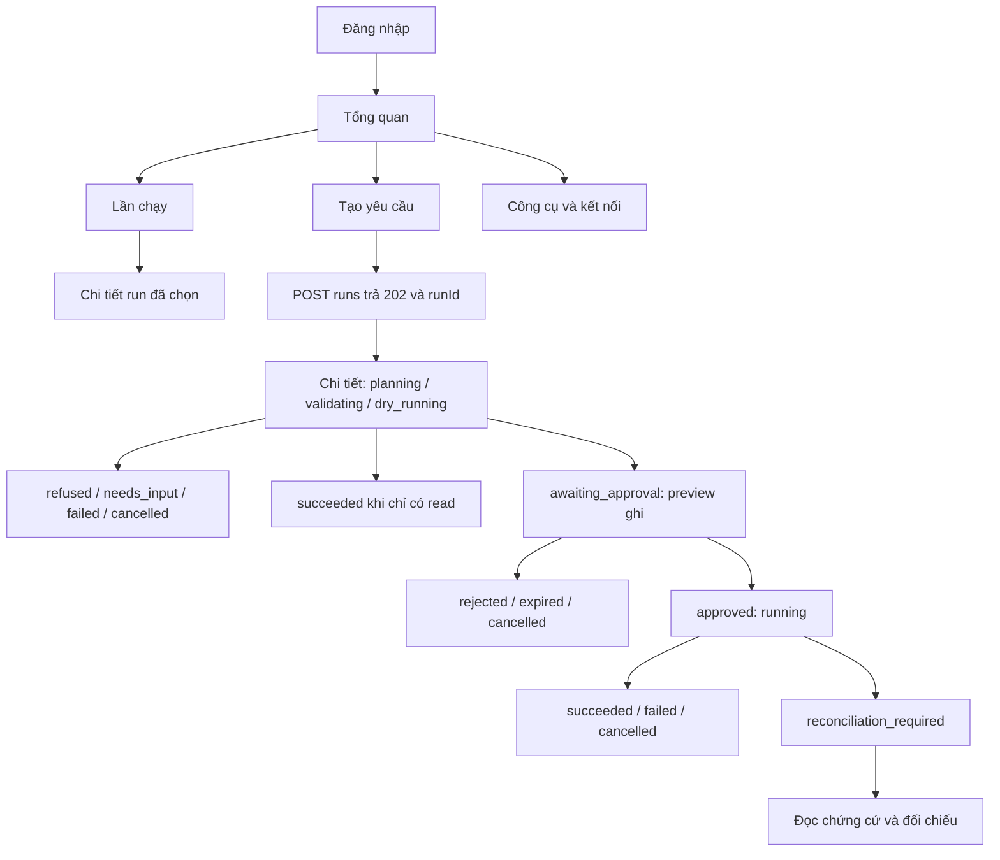

# Cấu trúc sản phẩm và UX flow — AI Workflow Automation Platform

Ngày: 15/09/2026. Source được đối chiếu: `03efe3e`.

**Trạng thái: ADOPTED_FOR_FRONTEND_PLAN — cập nhật ở WEB-00 ngày 15/09.** Người dùng đồng ý tiếp bước đánh giá stack/lập kế hoạch. Điều hướng sáu view được đồng bộ vào baseline/FR/lịch; [ADR-001](../../ADR-001-FRONTEND-STACK.md) chọn React + TypeScript + Vite cho kế hoạch. [System design cấp hệ thống](2026-09-15-platform-system-design.md) hiện là `DRAFT_FOR_REVIEW`; WEB-01B chỉ là fixture shell provisional cho tới khi system design được duyệt. Editor, workflow tái sử dụng, SaaS hoặc lịch chạy vẫn ngoài B/local.

## 1. Quyết định đề xuất

Xây giao diện có cấu trúc điều hướng của một platform, lấy lần chạy làm đơn vị vận hành trong đợt đầu. Đợt đầu có **6 view, 4 mục điều hướng chính**; hai bố cục cũ trở thành các phần dùng lại trong workspace này.

Số view phục vụ các việc khác nhau của người dùng, không dùng làm thước đo độ lớn của đồ án. Năng lực cốt lõi vẫn là yêu cầu tự nhiên → AI chọn công cụ/lập kế hoạch → validation → preview → approval → thực thi có kiểm soát → kết quả và chứng cứ. Planner hiện mới có fixture; có giao diện lập kế hoạch không chứng minh AI đã hoạt động.

| Phương án | Lợi ích | Chi phí và giới hạn | Kết luận |
|---|---|---|---|
| Giữ hai view tổng hợp | Ít công việc giao diện, hợp demo một luồng | Nhập yêu cầu, lịch sử và xử lý sự cố phải chia sẻ quá nhiều không gian | Giữ làm tham chiếu chi tiết, không làm toàn bộ sitemap mới |
| Workspace theo lần chạy, 6 view | Có nơi bắt đầu, kiểm công cụ, theo dõi và tìm lịch sử; phần lớn có API tương ứng | Cần navigation/session/view state; catalog công cụ còn thiếu DTO | Đề xuất cho đợt frontend kế tiếp |
| Platform workflow tái sử dụng và editor đầy đủ | Người dùng lưu, sửa, cấu hình inputs rồi chạy nhiều lần | Cần API CRUD, quy tắc version/draft/run, quyền, validation và lịch mới | Đợt mở rộng riêng sau khi scope được chốt |

## 2. Thuật ngữ và giới hạn đã kiểm

- **Yêu cầu:** nội dung người dùng gửi để hệ thống đề xuất cách làm.
- **Plan:** kế hoạch có thứ tự/phụ thuộc và công cụ; trong B/local người dùng xem, không sửa từng bước bằng UI.
- **Run / lần chạy:** một lần xử lý yêu cầu, có status, events, approval và attempts riêng. `planning` cũng đã là run.
- **Workflow tái sử dụng:** định nghĩa có tên, inputs và version, dùng để tạo nhiều run. DB có bảng workflow không chứng minh sản phẩm đã hỗ trợ năng lực này.
- **Approval:** quyền ghi gắn với đúng run/version/hash/expiry. Không chuyển sang run mới và không kế thừa khi người dùng đổi yêu cầu.
- **Trace:** chứng cứ của từng attempt trong lần chạy; khác với biểu đồ plan dự kiến.

`apps/web` hiện có WEB-01B fixture shell ở trạng thái provisional; live transport/polling chưa nối. API đã có login, nhận run, history/detail, approval/cancel, events, trace, reconciliation và server summaries. `GET /runs` trả tối đa 1.000 run; khi vượt giới hạn, implementation hiện trả `409 HISTORY_LIMIT`, không có cursor history hoặc truy vấn theo workflow.

Baseline và FR hiện ghi editor, sửa args trước duyệt, lưu workflow để tái sử dụng, rerun, xóa workflow, cấu hình MCP tùy ý và lịch định kỳ là ngoài B. Thiết kế này phân biệt mở rộng điều hướng với mở rộng nghiệp vụ đó.

## 3. Sitemap đợt frontend đầu

Các đường dẫn dưới đây là **UI route đề xuất**, không phải endpoint đã có. Quyết định dùng URL path hay hash route thuộc WEB-00; không trộn nó với `/api/v1`.

```text
Đăng nhập                         /login
Workspace
├── Tổng quan                     /overview
├── Tạo yêu cầu                   /new
├── Lần chạy                      /runs
│   └── Chi tiết lần chạy         /runs/:runId
│       ├── Kế hoạch & phê duyệt  (section/tab)
│       ├── Tiến trình & kết quả (section/tab)
│       └── Chứng cứ             (section/tab: trace/đối chiếu)
└── Công cụ & kết nối             /tools
```

Đăng nhập và chi tiết run không phải hai mục sidebar riêng. Các tab trong run giữ nguyên runId, không tạo run mới. Desktop có sidebar và nội dung chính; mobile dùng nút Điều hướng mở panel. Bấm Back/Forward phải về đúng trang/run, không submit form hoặc tạo POST ngầm.

### V01 — Đăng nhập

Mục tiêu: vào tài khoản demo và trở lại đúng trang được yêu cầu.

- Form email/password có label, trạng thái đang gửi và lỗi đọc được bằng screen reader.
- Thành công: giữ bearer trong memory của tab, về route nội bộ hợp lệ đã yêu cầu; mặc định Tổng quan.
- `401`: báo thông tin đăng nhập không hợp lệ. `429`: báo thử lại sau; không đoán thời gian nếu server không gửi.
- Hết phiên ở bất kỳ trang nào: dừng polling, hủy request của phiên cũ, xóa dữ liệu được bảo vệ khỏi view và yêu cầu đăng nhập lại. Chỉ giữ return route chứa ID; không đưa prompt/token vào URL.
- Reload cần đăng nhập lại. UI có thể có hành động “Thoát phiên trên tab này”; đây là xóa token local, không quảng cáo logout toàn hệ thống vì API chưa có revoke-session endpoint.

**Chốt 17/09/2026 (brief `/impeccable shape`, mockup canvas “ATI Run Screens”, hàng V01):**

- Không có thanh điều hướng; logo trái, nhãn “Dữ liệu mô phỏng” phải khi là fixture. Desktop hai cột trong 1120px: trái là tiêu đề “Lập kế hoạch tự động, ghi dữ liệu chỉ khi bạn duyệt”, một câu mô tả và 3 bước có icon (mô tả việc → xem trước đích và nội dung ghi → duyệt rồi xem kết quả và chứng cứ); phải là thẻ form 420px bo 14px với mức bóng duy nhất. Mobile: form trước, giới thiệu thu gọn dưới form.
- Form thật: label luôn hiển thị, `autocomplete="username"`/`"current-password"`, nút hiện/ẩn mật khẩu (`aria-label`, `aria-pressed`), nút “Đăng nhập” 48px, dòng môi trường cuối form (“Chạy cục bộ trên máy này · Kế hoạch mẫu / AI lập kế hoạch”, không có địa chỉ/port/phiên bản).
- Build fixture điền sẵn email demo, ghi “Tài khoản demo local” và “Bản mô phỏng chấp nhận mật khẩu bất kỳ”; build live để trống, không gợi ý. Mật khẩu không bao giờ hiển thị.
- Trạng thái: đang gửi (khoá nút giữ nhãn + spinner, ô chỉ đọc); `401` banner danger “Email hoặc mật khẩu không đúng”, xoá mật khẩu, focus lại ô mật khẩu, giữ email; `429` banner danger “Đã thử quá nhiều lần hoặc máy chủ đang bận… thử lại sau ít phút” (API không gửi `Retry-After`, không đoán giây); lỗi mạng “Không kết nối được máy chủ local”; phiên hết hạn banner `neutral` nêu tên trang sẽ quay về (không hiện nội dung prompt), dữ liệu cũ đã xoá khỏi màn hình. Chưa vẽ: lỗi mạng, lỗi ô trống.

### V02 — Tổng quan

Mục tiêu: “Bây giờ tôi cần làm gì?”

- Ưu tiên lần chạy cần đối chiếu, tiếp theo chờ duyệt, rồi lần đang xử lý; mỗi mục có thời điểm và link Chi tiết.
- CTA “Tạo yêu cầu”; nếu có run đang hoạt động, dẫn tới run đó và giải thích giới hạn một run. Server vẫn là bên quyết định admission.
- Danh sách gần đây có status và trích yêu cầu; không cần biểu đồ trang trí hoặc phần trăm thành công chưa có ý nghĩa đo đạc.
- Rỗng: giải thích cách bắt đầu, cung cấp mẫu dev đã allowlist khi đang ở chế độ demo.
- Dữ liệu từ `GET /runs`; lỗi history-limit hiển thị riêng, không thay bằng dashboard rỗng hoặc số đếm 0.
- Số đếm là từ tập run tải thành công, không gọi là thống kê toàn hệ thống. Refresh khi vào trang; không tải cả lịch sử mỗi 2 giây để poll một run.

### V03 — Tạo yêu cầu

Mục tiêu: mô tả đầu vào, đích mong muốn và công việc cần thực hiện.

- Ô yêu cầu tiếng Việt/Anh; timezone mặc định Asia/Ho_Chi_Minh; trường inputs scalar trong disclosure khi cần.
- Hành động chính “Lập kế hoạch”. Không dùng “Chạy ngay” vì trước đó còn validation và approval.
- Chế độ fixture hiển thị nhãn “Demo bằng kế hoạch mẫu”; hướng người dùng chọn đúng mẫu. Không giả vờ nhập tự do sẽ có AI thật.
- Gửi `POST /runs`; chỉ điều hướng khi nhận `202` với runId. Xóa cờ submitting khi lỗi nhưng không tự gửi lại POST nếu mất phản hồi.
- Nếu mất phản hồi tạo run: báo “Chưa xác nhận đã tạo”; mở/làm mới Lần chạy để kiểm. Nếu có nhiều ứng viên, để người dùng chọn, không suy bằng độ giống prompt rồi tự retry.
- `409 ACTIVE_RUN`: giữ draft trong phiên hiện tại, đề nghị mở run đang hoạt động. `503 PLANNER_UNAVAILABLE`: báo tính năng lập kế hoạch chưa sẵn sàng.
- Đổi route trước submit không được tạo workflow hoặc run. Draft chỉ ở memory, không đưa vào persistent storage mặc định.

**Chốt 17/09/2026 (brief `/impeccable shape`, mockup canvas “ATI Run Screens”, hàng V03):** một màn, **hai chế độ** với cùng bố cục hai cột (form trái, cột “Hệ thống làm được gì” 372px phải; mobile thu cột này thành disclosure).

- *Demo/kế hoạch mẫu* (planner `dev_fixture`): nhãn “Kế hoạch mẫu”; ô yêu cầu chỉ đọc; chọn một trong các mẫu đã allowlist bằng thẻ radio; mẫu cần filesystem bị vô hiệu kèm lý do khi filesystem tắt.
- *AI lập kế hoạch* (planner thật, khi có): nhãn “AI lập kế hoạch”; nhập tự do; gợi ý dạng chip chèn vào ô rồi sửa được; ghi rõ AI có thể hiểu sai, hỏi lại hoặc từ chối; cột phải thêm “AI có thể trả lời: Kế hoạch · Hỏi lại · Từ chối”.
- Nhãn chế độ luôn hiển thị; chế độ lấy từ cấu hình launch tin cậy cho tới khi có endpoint capabilities. Danh sách mẫu demo là allowlist prompt công khai trong frontend, có test khớp với các entry của `apps/api/src/dev-planner.ts`; gợi ý chế độ AI lấy từ ca dev b01–b06, không dùng holdout b07–b10.
- Tuỳ chọn nâng cao là disclosure (múi giờ + cặp khoá–giá trị chuỗi/số/đúng-sai), đóng mặc định với dòng tóm tắt. Không hỏi xác nhận khi rời trang; chỉ ghi “Nháp không được lưu khi rời trang”. Phím tắt Ctrl+Enter.
- Mất phản hồi: banner `unknown`; hành động chính là nút primary “Mở Lần chạy để kiểm tra”; gửi lại là nút secondary “Gửi lại yêu cầu” kèm điều kiện, không tự gửi lại (server chặn trùng bằng `409 ACTIVE_RUN`). `409 ACTIVE_RUN`: nút “Lập kế hoạch” disabled với lý do, CTA primary “Mở lần chạy đang chờ”. Mẫu bị chặn dùng `aria-disabled` để lý do đọc được bằng bàn phím. Chưa vẽ: trạng thái đang gửi, `503`, `400`.

### V04 — Lần chạy

Mục tiêu: tìm lại một lần chạy, xem yêu cầu gì và kết quả ra sao.

- Danh sách có thời gian, yêu cầu, status và link chi tiết; lọc status/tìm prompt trên dữ liệu đã tải.
- Hiển thị rõ đây là “Lần chạy”, không đổi tên thành thư viện workflow tái sử dụng.
- Giữ bộ lọc khi quay về từ Chi tiết trong cùng phiên. Empty history và không có kết quả lọc dùng hai thông điệp riêng.
- `409 HISTORY_LIMIT`: thông báo cần hỗ trợ API history pagination; không âm thầm cắt dữ liệu hoặc hứa tìm được mọi run.
- Không có nút clone/rerun/delete trong đợt đầu. Yêu cầu mới được người dùng tạo và duyệt riêng.

**Chốt 17/09/2026 (brief `/impeccable shape`, mockup canvas “ATI Run Screens”, hàng V04):**

- Danh sách phẳng mới nhất trước, rộng 1120px, không cột phải. Đầu trang: “N lần chạy đã tải · Tải lúc hh:mm:ss”, nút “Làm mới” (GET, không poll 2 giây) và “Tạo yêu cầu”.
- Lọc 5 nhóm có số đếm trên dữ liệu đã tải: *Tất cả · Cần xử lý* (`awaiting_approval`, `reconciliation_required`) *· Đang chạy* (`planning`, `validating`, `dry_running`, `running`, `replanning`) *· Hoàn tất* (`succeeded`) *· Không hoàn tất* (`failed`, `rejected`, `cancelled`, `expired`, `refused`, `needs_input`). Tìm theo nội dung yêu cầu và tiền tố mã run, không phân biệt hoa thường và dấu; lọc và tìm kết hợp.
- Hàng là link tới V05: badge, yêu cầu tối đa 2 dòng, thời gian tạo, mã run, dòng phụ suy từ dữ liệu có sẵn (số bước, số thao tác ghi, tên server; “Hết hạn duyệt lúc hh:mm” tĩnh cho `awaiting_approval`; số thao tác ghi chưa rõ cho `reconciliation_required`; câu của planner cho `refused`/`needs_input`). `created_at` thiếu thì ghi “Không rõ thời gian”. Chưa có quy tắc ánh xạ đích theo tool thì chỉ hiện tên server.
- Hiển thị 50 hàng + “Hiển thị thêm” theo bước 50, kèm “Đang hiển thị X / Y”. Quay về từ V05 giữ bộ lọc, từ khoá, số hàng và vị trí cuộn trong bộ nhớ (không vào URL). Kết quả lọc thông báo qua `aria-live`.
- Trạng thái: chưa có run (ẩn thanh lọc, CTA “Tạo yêu cầu đầu tiên”); không khớp (nêu nhóm + từ khoá, “Xoá bộ lọc”); `409 HISTORY_LIMIT` (banner `neutral` vì là giới hạn chứ không phải lỗi, không hiển thị danh sách một phần, không có “Thử lại”/“Làm mới”, chỉ “Mở Tổng quan”); lỗi mạng/dữ liệu sai hợp đồng (banner danger + “Thử lại”); `401` về đăng nhập. Chưa vẽ: đang tải, lỗi mạng, > 50 run.
- Rủi ro ghi nhận: `GET /runs` trả RunDetail đầy đủ tới 1000 run; đo payload/thời gian render ở WEB-03 trước khi đề xuất API tóm tắt.

### V05 — Chi tiết lần chạy

Mục tiêu: hiểu kế hoạch, quyết định việc ghi, theo dõi kết quả và xem chứng cứ tại một nơi.

- Header ổn định: yêu cầu gốc, thời gian, status và tác vụ chính. Điều hướng Kế hoạch / Tiến trình / Chứng cứ không thay run.
- Plan hiển thị các bước có tool, read/write, dependency và dữ liệu liên quan. Đây là trình xem; không có kéo-thả, sửa args hoặc skip tay.
- Chờ duyệt: đưa số thao tác ghi, đích và payload cụ thể lên đầu, `ActionCard` cho từng write; read outputs mở được. Duyệt đúng tuple nhận từ API. Nếu thiếu payload/tuple hoặc đang tải lại, khóa duyệt và hiển thị lý do.
- TTL lấy `approval.expires_at`, không hardcode 10/15 phút. Đồng hồ client hỗ trợ người dùng; server mới quyết định hết hạn. Khi đồng hồ về 0, khóa duyệt và fetch lại detail, không tự ghi status terminal.
- Chọn duyệt/từ chối: một request đang chờ, không double-submit; gặp `409` fetch lại. Mất phản hồi quyết định: giữ trạng thái “đang xác nhận”, đọc lại detail trước khi cho quyết định tiếp.
- Đang chạy: timeline attempt và outcome thật; progress theo giai đoạn, không tự sinh phần trăm từ số tool hay animation. Cancel là yêu cầu ngăn bước kế tiếp, không hứa hoàn tác.
- Kết thúc: đưa kết quả có chứng cứ lên trước trace; `succeeded` là thực thi xong, không tự đổi thành “AI đúng 100%”.
- Đối chiếu: banner giải thích thao tác chưa rõ kết quả; mở receipt/dispatch marker và trace. Marker filesystem không chứng minh write hoàn tất. Không có nút retry/resume, không có nút xác nhận đã giải quyết khi API chưa hỗ trợ.

### V06 — Công cụ & kết nối

Mục tiêu: biết hệ thống có thể làm gì, trên đích local nào và đang sẵn sàng đến đâu.

- Hai preset task_hub và filesystem; hiển thị trạng thái quan sát, thời điểm fetch, read/write policy và schema khi có catalog hợp lệ.
- `GET /servers` hiện chỉ cung cấp slug/status/policy_version. Có thể triển khai trang trạng thái trước; không gọi hai hàng server là danh sách 10 tool.
- Không dùng `testdata/tools.json` làm bằng chứng server đang kết nối. Trang fixture phải gắn nhãn rõ.
- “Làm mới trạng thái” chỉ GET; không có tác dụng bật MCP. Gateway hiện kết nối theo nhu cầu nên disconnected chưa đủ kết luận package hỏng hoặc chưa cài.
- ~~Cần công việc backend riêng cho catalog live và kiểm kết nối chủ động.~~ Đã có từ API-CATALOG (`c80dedc`): `GET /servers/catalog` chỉ đọc, không khởi động MCP; `POST /servers/check` là kiểm tra chủ động duy nhất trên preset reviewed cố định, rate-limit 5 giây (`429` + `Retry-After`), lỗi cấu hình/kết nối trả `503`. Mỗi tool có `name`, `side_effect`, `policy_version`, `artifact_hash`, `input_schema`, `output_schema`; không có mô tả.
- Không có form nhập Slack token, nút “Kết nối Trello thật”, thêm/xóa server tùy ý hoặc credential vault.

**Chốt 17/09/2026 (brief `/impeccable shape`, mockup canvas “ATI Run Screens”, hàng V06):**

- Trang một cột 1120px. Đầu trang giải thích chỉ dùng máy chủ local đã review và quyền đọc/ghi do chính sách ứng dụng quyết định; dòng “N máy chủ đã review · Kiểm tra lúc hh:mm:ss” hoặc “Chưa kiểm tra trong phiên này”; nút primary “Kiểm tra kết nối”.
- Vào trang chỉ gọi `GET /servers/catalog`. `POST /servers/check` **chỉ khi người dùng bấm**; đang kiểm tra khoá nút, giữ nhãn; `429` khoá nút và đếm ngược theo `Retry-After`; `503` banner danger, giữ dữ liệu lần trước và ghi rõ có thể đã cũ; `401` về đăng nhập; dữ liệu sai hợp đồng không render.
- Mỗi server một khối ngăn bằng hairline: tên dễ hiểu + slug mono (“Dữ liệu nhóm · `task_hub`”, “Tệp cục bộ · `filesystem`”), badge trạng thái, tóm tắt “N công cụ · X đọc · Y ghi · chính sách … · quan sát lúc …”. `disconnected` khi chưa kiểm tra = “Chưa kiểm tra trong phiên này” (trung tính, không hiện “0 công cụ”); sau kiểm tra = “Không kết nối được” (không kết luận package hỏng); `error` = danger; `unreviewed` = `unknown` “Chưa review — bị chặn”, không liệt kê tool. filesystem tắt theo launch policy hiện “Đang tắt theo cấu hình” khi frontend biết từ cấu hình launch tin cậy (API không có trạng thái riêng).
- Tool: icon, nhãn và mô tả tiếng Việt từ **bảng nhãn trong frontend có test khớp tên catalog** (tool lạ hiện tên gốc + “Chưa có mô tả”), pill Đọc/Ghi luôn từ `side_effect`, disclosure “Chi tiết kỹ thuật”: tên gốc, chính sách + `policy_version`, `artifact_hash` rút gọn có sao chép, bảng tham số từ `input_schema`, tóm tắt kết quả sinh từ `output_schema`, “Xem JSON schema”.
- Mobile: nút kiểm tra full-width; hàng tool xếp dọc; bảng tham số cuộn ngang trong khung riêng. Cuối trang: “Đã sẵn sàng? Tạo yêu cầu”.
- Chưa vẽ: đang kiểm tra, `error`, `unreviewed`, tool lạ.

## 4. Trạng thái run và hành động

Tất cả 14 trạng thái dùng chung V05; không tạo 14 trang. Các terminal sau không tự chuyển về `planning`. Hiển thị replan không chứng minh planner/replan runtime đã triển khai.

| Status | Nội dung chính | Hành động người dùng |
|---|---|---|
| planning | Đang lập kế hoạch | Xem yêu cầu, yêu cầu hủy |
| validating | Đang kiểm kế hoạch; lượt sửa chỉ khi có dữ liệu | Xem lỗi đã cung cấp, yêu cầu hủy |
| dry_running | Đang đọc dữ liệu cho bản xem trước | Xem bước đọc, yêu cầu hủy |
| awaiting_approval | Những thao tác sẽ ghi và TTL | Duyệt/từ chối đúng snapshot, yêu cầu hủy |
| running | Tiến trình thực thi | Xem trace, yêu cầu hủy |
| replanning | Đang điều chỉnh bước theo quy tắc engine | Xem lý do/phiên bản, yêu cầu hủy; chỉ duyệt khi server đưa về awaiting_approval |
| succeeded | Kết quả và các thao tác đã hoàn thành | Xem dữ liệu/trace |
| failed | Lỗi và kết quả đã biết của từng bước | Xem trace; không có retry tự động |
| cancelled | Đã dừng; có thể đã có thao tác hoàn tất | Xem trace/kết quả từng bước |
| refused | Lý do không thể lập kế hoạch hỗ trợ | Về Tạo yêu cầu; không sửa run cũ |
| needs_input | Câu hỏi làm rõ | Người dùng tạo yêu cầu mới chứa bổ sung; API chưa có trả lời tiếp trên run cũ |
| rejected | Đã từ chối ghi | Xem snapshot và trace |
| expired | Quyền duyệt đã hết hạn | Xem lịch sử; yêu cầu mới phải tạo run/preview mới |
| reconciliation_required | Thao tác chưa rõ kết quả | Xem đối chiếu và chứng cứ; không retry/resume |

Hủy là cooperative: sau POST cancel `202`, UI báo đã gửi yêu cầu hủy và tiếp tục poll đến terminal thật. Retry/skip của step là trạng thái engine, không phải nút để người dùng ép chạy lại.

**Chốt V05 theo trạng thái — 17/09/2026 (brief `/impeccable shape`, mockup canvas “ATI Run Screens”, hàng V05 và “V05 — Các trạng thái khác”):** mọi trạng thái dùng chung bố cục hai cột (nội dung trái, thẻ tóm tắt 372px dính phải với hộp chia ô, hành động và bảng khoá–giá trị); chỉ `awaiting_approval` có đồng hồ thời hạn lớn và nút duyệt.

| Nhóm trạng thái | Nội dung trái | Thẻ phải |
|---|---|---|
| `planning`, `validating`, `dry_running`, `replanning` | Banner `progress` nói hệ thống sẽ dừng chờ duyệt trước mọi thao tác ghi; danh sách 6 giai đoạn (giai đoạn hiện tại có spinner, không phần trăm); hoạt động | KẾ HOẠCH/ĐÃ GHI “Chưa có”; “Yêu cầu huỷ” + “Huỷ sẽ dừng trước bước kế tiếp” |
| `awaiting_approval` | Như mockup V05 đã chốt: banner action, kế hoạch, thẻ ghi dạng người đọc được | Thẻ quyết định với đồng hồ, duyệt/từ chối |
| `running` | Banner `progress` nêu ghi chưa rõ sẽ dừng và đối chiếu; kết quả từng bước (xong / đang chạy / chưa chạy) | ĐÃ XONG x/y · ĐANG CHẠY bước n; “Yêu cầu huỷ” + “không hoàn tác thao tác đang chạy” |
| `succeeded` | **Kết quả trước** (mỗi thao tác ghi: việc đã làm, vùng/đích, có biên nhận lúc…), ghi chú “Hoàn tất” không phải kiểm chứng nghiệp vụ; các bước; hoạt động | HOÀN TẤT · ĐÃ GHI; “Xem chứng cứ”, “Tạo yêu cầu mới” |
| `failed` | Banner danger nêu bước và lỗi đã biết, trạng thái ghi (“chắc chắn chưa ghi” chỉ khi server xác nhận); các bước; chi tiết lỗi (`error_class`, thông điệp) | HOÀN TẤT x/y · THẤT BẠI bước n · ĐÃ GHI; không có nút thử lại |
| `reconciliation_required` | Theo receipt của `GET /runs/:id/reconciliation` (xem mục “Đối chiếu theo receipt” dưới bảng) | XONG · CHƯA RÕ · XÁC NHẬN KHI ĐỐI CHIẾU; “Xem chứng cứ”; “Tạo lại yêu cầu này” hoặc “Tạo yêu cầu mới” theo receipt; không gửi lại |
| `needs_input` | Banner `planner` với câu hỏi nguyên văn; “Việc tiếp theo” gợi ý yêu cầu viết lại; dải giai đoạn dừng ở lập kế hoạch | KẾ HOẠCH “Không có” · ĐÃ GHI “Không”; “Tạo yêu cầu mới”, không trả lời tiếp trên run cũ |
| `refused` | Banner `planner` với lý do; giải thích chỉ dùng công cụ đã review; link Công cụ & kết nối | LÝ DO; “Tạo yêu cầu mới” |
| `expired` | Banner `neutral` “không có thao tác ghi nào được thực hiện”; bản xem trước chỉ để xem lại (nền `surface-soft`) | ĐÃ DUYỆT/ĐÃ GHI “Không”; không duyệt lại được |
| `rejected`, `cancelled` | Theo mẫu `expired`; `cancelled` liệt kê các bước đã xong trước khi huỷ và thao tác ghi đã có biên nhận (chưa vẽ riêng) | Nhãn `neutral`; “Tạo yêu cầu mới” |

Nội dung lỗi, câu hỏi và lý do planner trên mockup là minh hoạ; khi triển khai lấy từ `error_class`/`error_message` của attempt và `planner_result` thật.

**Đối chiếu theo receipt — chốt 17/09/2026 (`/impeccable shape`, canvas hàng V05: ReconSoft, ReconConfirmed, ReconConflict; V02 OverviewSoft; V03 CreateRetry). Chỉ UI, không API mới.**

- Section chính “Đối chiếu từng thao tác ghi”: “Kiểm tra lúc hh:mm:ss” + nút GET “Tải lại kết quả đối chiếu” (đang tải khoá nút; lỗi giữ kết quả cũ và ghi có thể đã cũ). Mỗi thao tác ghi là một `<article>`: dòng kết luận `role="status"` có icon/màu, ô ĐÃ GỬI LÚC / NƠI NHẬN / BIÊN NHẬN, **payload mở sẵn**, hướng dẫn theo kết luận, disclosure “Chi tiết kỹ thuật” (operation id, `receiver_mode`, `state`, receipt thô, hash).
- Kết luận theo `receipt`: `confirmed` → “Nơi nhận xác nhận đã ghi — không cần ghi lại” (`success`, không có “Tạo lại”); `not_observed` → “Chưa thấy trên nơi nhận — kiểm tra bảng đích trước khi tạo lại” (`unknown`, hộp “Cách kiểm tra”, “Tạo lại yêu cầu này” là nút secondary kèm cảnh báo); `conflict` → “Nơi nhận có dữ liệu khác với nội dung đã gửi — kiểm tra thủ công” (`danger`, “So sánh với nội dung đã gửi” chỉ hiện payload đã gửi vì API không trả dữ liệu hiện tại ở nơi nhận; “Tạo lại” `aria-disabled` tới khi mở so sánh); `not_supported` → “Nơi nhận không hỗ trợ đối chiếu tự động — cần tự kiểm tra” (`unknown`, như `not_observed`).
- Banner tổng hợp theo thao tác xấu nhất: mọi thao tác `confirmed` → banner `success` “Đã đối chiếu…”, kèm giải thích run vẫn mang trạng thái “Cần đối chiếu” và bước nào đã không chạy; ngược lại banner `unknown`/không tự gửi lại. Thẻ phải: “Tạo yêu cầu mới” (primary) khi mọi thao tác `confirmed`, còn lại “Tạo lại yêu cầu này”.
- V02 Tổng quan gọi GET reconciliation cho các run `reconciliation_required` (thường 0–2): chỉ đưa vào “Cần xử lý” khi còn thao tác chưa `confirmed` (thẻ ghi “N thao tác ghi chưa thấy trên nơi nhận (kiểm tra lúc …)”); mọi thao tác `confirmed` → hàng thường với ghi chú “Đã xác nhận khi đối chiếu”; lỗi tải receipt → giữ trong “Cần xử lý”.
- V03 “Tạo lại yêu cầu này” (chỉ chế độ AI): điền sẵn prompt cũ vào nháp **trong bộ nhớ** (không đưa prompt vào URL), banner `unknown` “Tạo lại từ lần chạy cần đối chiếu” nêu mã run, dặn kiểm tra bảng đích, link quay lại đối chiếu; banner liên kết với ô yêu cầu qua `aria-describedby`. Chế độ demo chỉ dẫn tới Tạo yêu cầu.
- Chưa vẽ: nhiều thao tác ghi với receipt khác nhau, `not_supported`, mobile của màn đối chiếu.

**Kịch bản demo — chốt 18/09/2026 (`/impeccable clarify`).** Nhãn “Dữ liệu mô phỏng” và nội dung phải khớp nhau:

- **Màn chế độ demo** (có nhãn fixture) chỉ dùng đúng yêu cầu và dữ liệu của fixture server-owned: prompt `b02` “Chép nguyên các dòng Progress!A1:B2 … #team” và hai mẫu `fs-*`. Mọi tham chiếu tới lần chạy đang hoạt động trên các màn này (vd. `409 ACTIVE_RUN`) cũng dùng chính prompt đó.
- **Màn chế độ AI/live** (không có nhãn fixture) dùng kịch bản tiếng Việt “tuần 37/38 · Tiến độ nhóm → Báo cáo tuần · #nhom-ati”; nhãn chế độ trong thẻ tóm tắt là “AI lập kế hoạch”.
- Thời gian trong danh sách và Tổng quan ghi rõ là **lúc tạo yêu cầu**; thẻ “Cần xử lý” ghi “Kết thúc lúc …”. Thời hạn duyệt tính đúng 10 phút kể từ khi bản xem trước sẵn sàng.

**Cắt gọn — chốt 18/09/2026 (`/impeccable distill`).** Bỏ những gì màn hình không cần để người dùng ra quyết định:

- **V02 bỏ bảng chú giải 14 trạng thái.** Bản đồ `RunStatus` → nhãn/màu/icon chỉ nằm trong [DESIGN.md](../../../DESIGN.md) mục Run status; mỗi hàng trên màn đã tự mang pill của nó. Tiêu đề phụ bỏ “2 lần chạy cần bạn xử lý” (badge nav và khu “Cần xử lý” đã nói), và hai câu về “một lần chạy hoạt động” gộp thành một.
- **Định danh kỹ thuật vào disclosure “Chi tiết kỹ thuật”** trong thẻ tóm tắt V05 và màn đối chiếu: phiên bản kế hoạch và mã băm bản xem trước ẩn sau nút có chevron/`aria-expanded`, chỉ `succeeded` mở sẵn. Thẻ chỉ còn để lộ Duyệt bởi / Múi giờ / Chế độ lập kế hoạch. Dùng lại đúng component `TechDisclosure` của V06 nên không thêm API hay thành phần mới.
- **V04 không lặp số:** tổng “12 lần chạy đã tải” thuộc dòng chân danh sách; tiêu đề phụ chỉ còn “Tải lúc …” và nghĩa của cột thời gian. Chân danh sách mobile đổi sang “Đang hiển thị 7 / 12 lần chạy đã tải · nhóm …” để vẫn giữ tổng.
- **Màn chờ nói thời gian đã trôi:** `planning` và `running` thêm dòng “mốc bắt đầu · đã N giây” trong banner trạng thái. `planning` bỏ mục “Hoạt động” (hai mốc trùng dải “Tiến trình”) cùng hairline ngăn section; `running` giữ vì nhật ký ở đó có mốc duyệt và mốc xem trước.
- **Khung artboard bằng chiều cao nội dung** (đo trong trình duyệt với Be Vietnam Pro, làm tròn lên 20px). 34/35 khung trước đó thừa 11–533px khoảng trắng và `ReconConflict` thiếu 64px nên bị cắt; nay không khung nào tràn.

**Chữ — chốt 18/09/2026 (`/impeccable typeset`).** Thang chữ đầy đủ nằm trong [DESIGN.md](../../../DESIGN.md); phần áp dụng cho mockup:

- **Thang mobile** thêm ba token (`display-timer-mobile` 32/36, `display-md-mobile` 23/31, `headline-sm-mobile` 18/25) nên bậc lớn nhất đạt 1.39× và 1.28×, hết cảnh báo `flat-type-hierarchy` ở V05/V06 mobile. Tiêu đề run mobile vẫn nằm trong 3 dòng nên chưa cần link “Xem toàn bộ yêu cầu”.
- **Bỏ cỡ ngoài thang:** 17px (thẻ “Cần xử lý” V02, ô yêu cầu V03, đoạn giới thiệu V01) về 16/24 đúng `body-lg` như DESIGN.md đã quy định; 12.5px về `mono-sm` 12px; “ATI” thống nhất `wordmark` 20/24 desktop, 18/22 mobile.
- **`overline` lên 12/16** vì 11px làm bẹt dấu trên chữ hoa tiếng Việt (ĐÃ GỬI LÚC, XÁC NHẬN KHI ĐỐI CHIẾU); đã kiểm tra không nhãn nào xuống dòng sau khi tăng.
- **Trần độ dài dòng ~75 ký tự** áp cho 21 khối văn xuôi; trước đó dài nhất là 101 ký tự (V04 `HISTORY_LIMIT`, V06 `503`/chưa kiểm tra). Tiêu đề và nội dung yêu cầu không áp trần.
- Board `MainMobile` vẫn còn cảnh báo thang chữ phẳng: đó là phương án cũ đã loại, giữ trên canvas để đối chiếu, không sửa.

**Mobile — chốt 18/09/2026 (`/impeccable adapt`, sau critique 29/40).** Thiết kế lại cho người dùng mobile hay bị gián đoạn, không chỉ thu nhỏ desktop:

- **Màn duyệt (`MobileSoft`, P0):** thanh dính đáy có thêm dòng “Hết hạn lúc 14:32:10 theo máy chủ” trên đồng hồ, vì đồng hồ đếm phía client không có mốc khi người dùng quay lại app. Câu “Nếu dữ liệu nguồn thay đổi, hãy tạo yêu cầu mới thay vì duyệt bản này.” đặt trong banner chờ duyệt ở đầu trang, chỗ đọc đầu tiên khi quay lại; nút duyệt có `aria-describedby` tới cả hai. Dưới “Từ chối ghi” thêm “Bạn sẽ thấy kết quả từng bước sau khi duyệt” như desktop.
- **Payload dạng bảng trên màn duyệt mobile** đổi từ bảng cuộn ngang (cắt giữa ô, không có dấu hiệu cuộn) sang bản ghi có nhãn DÒNG n · Tuần / Thành viên / Công việc / Tình trạng. Board dài thêm ~260px; đổi lại người dùng đọc hết mọi ô mình sắp đồng ý ghi.
- **Màn duyệt — chốt phương án B, 18/09/2026 (`/impeccable shape`).** Critique 29/40 chỉ ra đồng hồ 56px là phần tử lớn nhất màn duyệt, trong khi đó là thứ duy nhất người dùng không làm gì được. Đã vẽ phương án B cạnh A và chọn B:
  - Thẻ quyết định mở đầu bằng “Bạn sắp ghi” và mỗi thao tác ghi một dòng 21px đậm có icon (“Thêm 3 dòng vào “Báo cáo tuần””, “Gửi 1 tin nhắn vào #nhom-ati”); hộp THAO TÁC GHI / ĐÃ GHI / ĐÍCH bỏ vì nội dung đã nằm trong câu. Tiếp theo là dòng “Chế độ lập kế hoạch”.
  - Đồng hồ là một dòng “Còn 08:41” 16px + “Hết hạn lúc 14:32:10 theo máy chủ” ngay trên nút duyệt. Còn ≤ 2 phút: dòng này chuyển nền `action-subtle`, icon đồng hồ cát, “Sắp hết hạn · còn 01:48”; bố cục không đổi, không nhấp nháy; `aria-live` thêm mốc 2 phút (board `MainSoft2min`).
  - Mobile theo cùng nguyên tắc: thanh dính đáy là một dòng “Còn 08:41 · hết hạn lúc 14:32:10 theo máy chủ” + nút duyệt rộng hết thanh; bỏ số 32px.
  - DESIGN.md bỏ token `display-timer` và `display-timer-mobile`, thêm `decision-timer-urgent` và `write-summary`. Phương án A giữ ở hàng “Cũ” (`MainSoftA`) để đối chiếu.
- **Polish sau critique — 18/09/2026:** “Chế độ lập kế hoạch” có trên mọi thẻ tóm tắt V05 và màn đối chiếu (trước đó 3/35 board). `Create409` và `CreateLost` giữ nguyên bố cục của `CreateSoft` — cột “Hệ thống làm được gì”, chọn mẫu, thanh khoá có `aria-describedby`, ô yêu cầu 4 dòng — banner trạng thái chỉ chèn thêm vào cột trái; hàng “Giá trị đầu vào” dùng một chiều cao 56px và một cỡ chữ 16px. Mobile bỏ hộp THAO TÁC GHI / ĐÃ GHI / ĐÍCH (đã có trong bản ghi và banner) theo phương án B.
- **Harden sau critique — 18/09/2026:** focus-visible trên cả 36 board; 14 link chữ đứng riêng có vùng chạm 44px; thẻ “Cần xử lý” ở V02 thành link cả thẻ; “Xem chứng cứ” đổi từ nút sang link (6 board); mobile nâng 13 điều khiển 36px lên 44px; nút hiện mật khẩu 40 → 44px; V01 thống nhất dàn ý (H1 “Đăng nhập”, form trước trong DOM) và `Login401` hiện viền lỗi trên hai ô. `Login429` cố ý không có `aria-invalid` vì ô không sai. Hai “Tạo yêu cầu” trùng tên được giữ vì cùng đích.
- **Polish lượt cuối — 18/09/2026:** quét 36 board: màu chỉ từ token, cỡ chữ trong thang, bo góc 4/8/14/full, một độ dày nét icon, focus-visible ở mọi board, không còn chuỗi bị cấm trong bảng Copy conventions. `RunSucceeded` dời ghi chú “Hoàn tất nghĩa là…” xuống sau “Kết quả từng bước” để kết quả là ấn tượng đầu, giới hạn là chú thích. Detector trên board đang dùng chỉ còn `cramped-padding` (37, ngoại lệ đã đo); `side-tab`/`flat-type-hierarchy` chỉ còn ở board “Cũ ·”. Còn mở: `RunNeedsInput`/`RunRefused`/`RunExpired` chưa mang yêu cầu cũ sang V03 như `CreateRetry`; màn duyệt chưa giải thích “bản xem trước” cho người mới.
- **Bộ lọc V04 mobile (`RunsMobile`, P1):** hàng 5 pill cuộn ngang, nơi pill đang bật nằm ngoài màn hình, đổi thành một `select` 48px “Nhóm trạng thái” hiện rõ “Không hoàn tất · 7”, ngay dưới là “Đang hiển thị 7 / 12 lần chạy đã tải” và nút “Bỏ lọc”. Dòng chân cũ bỏ vì số đếm đã lên đầu. Cùng năm nhóm như desktop, chỉ khác control.

## 5. Luồng end-to-end



Mỗi cạnh thể hiện khả năng chuyển UI khi có dữ liệu server, không thay transition contract của engine. Local replan là nhánh mục tiêu: khi server báo `replanning`, UI hiển thị quá trình; khi nhận preview/version mới phải lấy tuple mới để duyệt. Không tái sử dụng approval cũ.

Reconnect HTTP: giữ seq đã ingest liên tục; không tăng cursor theo `RunDetail.last_seq` khi events chưa được đọc. Poll mỗi 2 giây, không chồng request; còn trang thì drain ngay đến hiện trạng. Khi detail terminal nhưng chưa ingest `run.finished`, tiếp tục drain. Response của run/phiên cũ không được cập nhật trang mới. Mạng lỗi: giữ dữ liệu lần cuối với nhãn thời điểm, không đặt status run thành failed.

## 6. API readiness và công việc bổ sung

Prefix thực tế: `/api/v1`. Endpoint mới dưới đây chỉ là đề xuất, chưa tồn tại.

| View/năng lực | API/code hiện tại | Giới hạn / công việc trước nghiệm thu |
|---|---|---|
| Login | POST /auth/login | Token memory; chưa có revoke server |
| Tổng quan/Lần chạy | GET /runs | Lọc local; thiếu pagination khi hơn 1.000 run; không endpoint metrics |
| Tạo yêu cầu | POST /runs | Planner dev_fixture/disabled; không dùng làm AI evaluation |
| Detail/approval/cancel | GET /runs/:id; POST approval; POST cancel | Revalidate trạng thái khi nhận 409/mất phản hồi |
| Timeline | GET /runs/:id/events?since_seq= | Tối đa 200 event/trang; drain liên tục |
| Trace | GET /runs/:id/trace?cursor= | Snapshot phân trang 100; hết hạn thì bắt đầu snapshot mới, không ghép hai snapshot |
| Đối chiếu | GET /runs/:id/reconciliation | Read-only; không API đánh dấu resolved hoặc replay |
| Trạng thái công cụ | GET /servers | Chưa có tool detail/live discovery DTO và thao tác kiểm preset từ UI |
| Workflow library/editor | Chưa có API sản phẩm tương ứng | Ngoài B; không suy từ bảng DB/workflow version rằng đã sẵn sàng |

API verdict hiện là `API_TECHNICAL_PASS` cho local `DEV_FIXTURE_PLANNER`: H01–H20 và cleanup delta đã pass ở gate 2026-09-17. Điều này đóng backend API-GATE nhưng không tự động nghiệm thu frontend; browser E2E, polling, accessibility và AI evaluation vẫn cần evidence riêng.

## 7. Mở rộng để thành platform workflow tái sử dụng

Khi chốt scope mở rộng, sitemap thêm **Workflow** với thư viện và chi tiết workflow; Tạo yêu cầu trở thành điểm vào trình soạn. Lịch sử run có thể lọc theo workflow, còn Chi tiết run vẫn là chứng cứ bất biến.

Mỗi năng lực có điều kiện rõ:

1. **Lưu và đặt tên:** ownership, draft versus immutable version, danh sách và cập nhật tên; không thay plan lịch sử.
2. **Chỉnh plan:** chỉ sửa draft, kiểm lại schema/graph/reference/policy; không sửa args trong run đang chờ duyệt. Xuất bản version mới khi hợp lệ.
3. **Chạy với inputs khác:** tạo run mới từ version đã chọn; capture runtime/read outputs mới và approval mới; không sao chép receipt hoặc dispatch marker.
4. **Catalog công cụ:** hiển thị capability thực từ preset đã review; thêm công cụ không đồng nghĩa được cấp write permission.
5. **Cài đặt:** chỉ có trang khi người dùng thực sự có việc cấu hình được hỗ trợ. Cấu hình model/provider của nghiên cứu phải có manifest riêng; credential không ở frontend.

Lịch chạy định kỳ, SaaS thật, account/team quản trị, workflow xóa/archive và graph kéo-thả không được tự thêm cùng task tạo sidebar. Muốn nâng những mục này thành phạm vi triển khai phải cập nhật baseline, FR, API, testdata và lịch đồng thời.

## 8. Nền tảng frontend: điều chỉnh căn cứ quyết định

Kiểm lockfile tại thời điểm thiết kế: **264 entries tổng, trong đó 258 đường dẫn chứa node_modules/**. Đây là số mục lockfile, không phải số package duy nhất hoặc số package thực cài trên Windows. `npm ls vite --all` cho thấy `vite@5.4.21` đi qua `vitest@2.1.9` và vite-node/mocker. Không thấy React, React DOM, Preact hoặc Lit trong lockfile. Con số 161 trong Git policy là số file được track ở một checkpoint cũ, không chứng minh dependency budget hiện tại.

Rút lại lập luận “chỉ có hai màn hình nên framework không mang lại nhiều” và “React/Vite chắc chắn thêm vài trăm package”. Mức tăng phải đo trên lockfile ứng viên; dùng dependency transitive làm dependency trực tiếp vẫn là thay đổi cần review. Package ít không tự chứng minh dễ audit hoặc an toàn hơn.

Thiết kế UX này không phụ thuộc framework. Các yêu cầu đánh giá dưới đây đã được xử lý ở [ADR-001 và kết quả đo WEB-00](../../ADR-001-FRONTEND-STACK.md): chọn React + TypeScript + Vite cho phạm vi sáu view hiện tại; [ADR-002](../../ADR-002-FRONTEND-UI-DATA-LAYER.md) thay CSS thuần bằng Tailwind CSS v4 + shadcn/ui và thêm TanStack Query; editor/library vẫn ngoài B. Các phép đo browser/focus/polling đầy đủ thuộc WEB-01–03, chưa có trong build probe.

- So sánh TS + DOM và một phương án component framework trên cùng bài toán: 6 view, polling không mất focus/disclosure, session expiry, URL navigation và action submit bị khóa.
- Đo dependencies trực tiếp/bắc cầu mới so baseline lockfile, package version/integrity, bundle thực, lệnh build/test và nơi phải bảo trì DOM/state thủ công. Không cài hai stack vào repo chính để đo.
- Giữ state/domain/API client độc lập với renderer; URL route không mang token hoặc prompt. Điều này giảm chi phí đổi renderer, nên lựa chọn không phải hoàn toàn không thể đảo ngược.
- Nếu dùng tsc thuần: phải giải quyết browser ESM specifier và runtime validation. `import type` bị xóa lúc build, không validate JSON; `tsc` không bundle Zod hoặc đổi bare specifier `@wap/dsl` thành URL trình duyệt. Không chấp nhận lời hứa “parser đã có” khi chưa chạy browser thật.
- Nếu dùng framework/build tool: khai báo dependency trực tiếp cần dùng, pin/review lock diff, không dựa vào việc Vitest tình cờ kéo Vite; kiểm artifact drift trước khi dùng preview backend đã lưu.

## 9. Kế hoạch giao việc sau khi chốt thiết kế

Đây là thứ tự bàn giao, chưa phải chỉ thị tự implement hoặc claim các task đã pass.

| Task | Deliverable có thể review riêng | Điều kiện xong |
|---|---|---|
| UX-00 (tài liệu này) | Sitemap 6 view, flow, state/action matrix, API gap | Người đọc phân biệt run/workflow, view/status và khả năng hiện tại/tương lai |
| WEB-00 | ADR stack dựa trên đo đạc và kế hoạch WEB-01–03 cụ thể | Chốt module/build/browser validation và ngân sách dependency; cập nhật tài liệu scope UI nếu nhận đề xuất |
| API-CATALOG (tách riêng) | Tool catalog và kiểm preset cho FR-CON-02/04 | Endpoint/DTO được thiết kế, owned, không arbitrary launch; output live được kiểm và không lộ credential |
| API-GATE (tách riêng) | Đóng phần negative/process/cleanup còn thiếu | Oracle và manifest chứng minh những case yêu cầu; không chỉ sửa nhãn verdict |
| WEB-01 | Navigation + 6 view + component/fixture | Có màn hình xem được, label fixture, 14 status, keyboard/responsive; chưa giả vờ gọi live |
| WEB-02 | Login + run lifecycle qua API thật | Poll/reconnect/session/approval/races không mất hoặc ghi trùng; catalog tích hợp khi API-CATALOG sẵn sàng |
| WEB-03 | Browser gate và báo cáo demo | B02 và filesystem flow có receiver evidence; trường hợp lỗi có chứng cứ; backend gate đối chiếu riêng |
| PLATFORM-NEXT | Spec library/editor/inputs/version | Chỉ giao khi scope mở rộng được chốt; không gộp vào WEB-01 |

File cần tạo ở đợt code sau thuộc `apps/web`: module session, navigation, API client, run state và event ingestion; view overview/new/history/run/tools/login; component dùng lại. Không áp đặt hàm render hoặc router cụ thể trước ADR. Có 5 component hiện có trong thiết kế (`StatusPill`, `TechDisclosure`, `ProgressStrip`, `ActionCard`, `TimelineRow`); thêm AppShell, EmptyState, ErrorState và SessionGate theo trách nhiệm, không tự xây virtual DOM framework.

Đường găng: UX-00 → WEB-00 → WEB-01 → WEB-02 → WEB-03. API-CATALOG và API-GATE có thể làm trong đợt backend độc lập trước khi nghiệm thu WEB-02/03. AI evaluation vẫn cần đợt AI/model/provider riêng; UI không thay thế công việc đó.

## 10. Nghiệm thu UX bằng tình huống cụ thể

- UX-A01: tài khoản có run chờ duyệt → Tổng quan chỉ đúng run → Chi tiết hiện đúng đích và payload → không POST cho đến click duyệt.
- UX-A02: tạo yêu cầu → 202 → Back/Forward/reload không tạo thêm run; reload yêu cầu login lại và đọc đúng runId.
- UX-A03: fixture đủ 14 status; refused/needs_input hiển thị outcome; plan rỗng không được vẽ như kế hoạch hợp lệ.
- UX-A04: hai click duyệt liên tiếp chỉ gửi một request; mất phản hồi thì đọc lại; tuple cũ gặp 409 không lén submit tuple mới.
- UX-A05: mất mạng, events nhiều trang hoặc detail terminal trước event cuối → đọc đủ seq và run.finished, giữ focus/disclosure và không reset cuộn khi poll.
- UX-A06: hết phiên giữa lúc poll → dữ liệu protected không còn trên màn hình, request cũ không repopulate sau logout/login.
- UX-A07: run unknown → chỉ có chứng cứ/đối chiếu; không tìm thấy retry/resume/mark-resolved trong view.
- UX-A08: tool đang disconnected → trang giải thích trạng thái hiện quan sát, không báo “đã sẵn sàng 10 tools” từ file fixture.
- UX-A09: history-limit hoặc API lỗi → có thông báo lỗi và cách refresh; không hiện danh sách rỗng giả.
- UX-A10: desktop 1280px, mobile 390px và 320px → không tràn ngang trang; keyboard đi tới nav, action và disclosure; màu không phải tín hiệu duy nhất.
- UX-A11: tool output chứa HTML/script hoặc secret canary → render text/safe projection, không thực thi nội dung hoặc ghi credential vào storage/log/URL.
- UX-A12: read-only run → có thể succeeded trực tiếp; không tạo bước approval hoặc thao tác ghi giả để đủ wizard.

## 11. Nguồn và ranh giới tài liệu

- [Baseline B/local](../../BASELINE.md) và [FR/NFR](../../functional-requirements.md): nguồn scope chính thức; điều hướng sáu view đã đồng bộ ở WEB-00, các năng lực mở rộng vẫn là đề xuất riêng.
- [Frontend handoff](../../FRONTEND-HANDOFF.md): endpoint và invariant khi render.
- [API status](../../API-STATUS-2026-09-15.md) và [audit API](../../AUDIT-API-01-05-2026-09-15.md): verdict có giới hạn bằng chứng.
- [screens.html](../../screens.html) và [wireframes.html](../../wireframes.html): dùng lại các panel/status/component, không dùng tiêu đề hai màn hình làm sitemap của thiết kế mới.
- [HTTP plan](../plans/2026-09-15-http-lifecycle.md): API-CATALOG là gap đã được ghi nhận; frontend live acceptance vẫn cần backend gate.

Kiểm tra tài liệu không phải browser QA. WEB-01B fixture shell đã có, nhưng chưa có browser QA với API thật, chưa đo usability hoặc chứng minh AI bằng thiết kế này.
