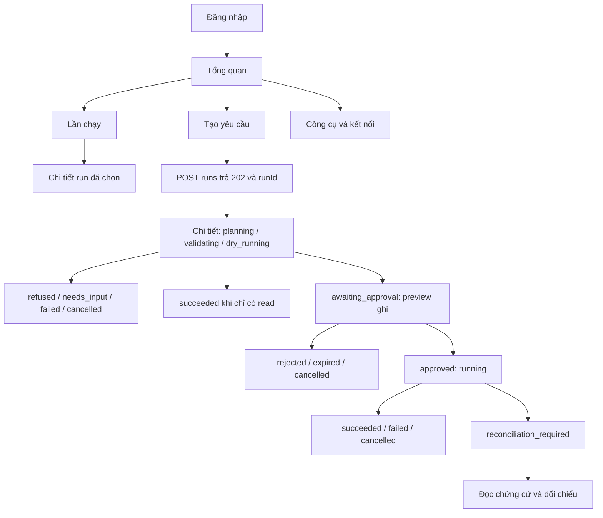

# Cấu trúc sản phẩm và UX flow — AI Workflow Automation Platform

Ngày: 15/09/2026. Source được đối chiếu: `03efe3e`.

**Trạng thái: ADOPTED_FOR_FRONTEND_PLAN — cập nhật ở WEB-00 ngày 15/09.** Người dùng đồng ý tiếp bước đánh giá stack/lập kế hoạch. Điều hướng sáu view được đồng bộ vào baseline/FR/lịch; [ADR-001](../../ADR-001-FRONTEND-STACK.md) chọn React + TypeScript + Vite cho kế hoạch. Editor, workflow tái sử dụng, SaaS hoặc lịch chạy vẫn ngoài B/local. Chưa có implementation frontend.

## 1. Quyết định đề xuất

Xây giao diện có cấu trúc điều hướng của một platform, lấy lần chạy làm đơn vị vận hành trong đợt đầu. Đợt đầu có **6 view, 4 mục điều hướng chính**; hai bố cục cũ trở thành các phần dùng lại trong workspace này.

Số view phục vụ các việc khác nhau của người dùng, không dùng làm thước đo độ lớn của đồ án. Năng lực cốt lõi vẫn là yêu cầu tự nhiên → AI chọn công cụ/lập kế hoạch → validation → preview → approval → thực thi có kiểm soát → kết quả và chứng cứ. Planner hiện mới có fixture; có giao diện lập kế hoạch không chứng minh AI đã hoạt động.

| Phương án | Lợi ích | Chi phí và giới hạn | Kết luận |
|---|---|---|---|
| Giữ hai view tổng hợp | Ít công việc giao diện, hợp demo một luồng | Nhập yêu cầu, lịch sử và xử lý sự cố phải chia sẻ quá nhiều không gian | Giữ làm tham chiếu chi tiết, không làm toàn bộ sitemap mới |
| Workspace theo lần chạy, 6 view | Có nơi bắt đầu, kiểm công cụ, theo dõi và tìm lịch sử; phần lớn có API tương ứng | Cần navigation/session/view state; catalog công cụ còn thiếu DTO | Đề xuất cho đợt frontend kế tiếp |
| Platform workflow tái sử dụng và editor đầy đủ | Người dùng lưu, sửa, cấu hình inputs rồi chạy nhiều lần | Cần API CRUD, quy tắc version/draft/run, quyền, validation và lịch mới | Đợt mở rộng riêng sau khi scope được chốt |

## 2. Thuật ngữ và giới hạn đã kiểm

- **Yêu cầu:** nội dung người dùng gửi để hệ thống đề xuất cách làm.
- **Plan:** kế hoạch có thứ tự/phụ thuộc và công cụ; trong B/local người dùng xem, không sửa từng bước bằng UI.
- **Run / lần chạy:** một lần xử lý yêu cầu, có status, events, approval và attempts riêng. `planning` cũng đã là run.
- **Workflow tái sử dụng:** định nghĩa có tên, inputs và version, dùng để tạo nhiều run. DB có bảng workflow không chứng minh sản phẩm đã hỗ trợ năng lực này.
- **Approval:** quyền ghi gắn với đúng run/version/hash/expiry. Không chuyển sang run mới và không kế thừa khi người dùng đổi yêu cầu.
- **Trace:** chứng cứ của từng attempt trong lần chạy; khác với biểu đồ plan dự kiến.

Hiện `apps/web` chỉ có README skeleton. API đã có login, nhận run, history/detail, approval/cancel, events, trace, reconciliation và server summaries. `GET /runs` trả tối đa 1.000 run; khi vượt giới hạn, implementation hiện trả `409 HISTORY_LIMIT`, không có cursor history hoặc truy vấn theo workflow.

Baseline và FR hiện ghi editor, sửa args trước duyệt, lưu workflow để tái sử dụng, rerun, xóa workflow, cấu hình MCP tùy ý và lịch định kỳ là ngoài B. Thiết kế này phân biệt mở rộng điều hướng với mở rộng nghiệp vụ đó.

## 3. Sitemap đợt frontend đầu

Các đường dẫn dưới đây là **UI route đề xuất**, không phải endpoint đã có. Quyết định dùng URL path hay hash route thuộc WEB-00; không trộn nó với `/api/v1`.

```text
Đăng nhập                         /login
Workspace
├── Tổng quan                     /overview
├── Tạo yêu cầu                   /new
├── Lần chạy                      /runs
│   └── Chi tiết lần chạy         /runs/:runId
│       ├── Kế hoạch & phê duyệt  (section/tab)
│       ├── Tiến trình & kết quả (section/tab)
│       └── Chứng cứ             (section/tab: trace/đối chiếu)
└── Công cụ & kết nối             /tools
```

Đăng nhập và chi tiết run không phải hai mục sidebar riêng. Các tab trong run giữ nguyên runId, không tạo run mới. Desktop có sidebar và nội dung chính; mobile dùng nút Điều hướng mở panel. Bấm Back/Forward phải về đúng trang/run, không submit form hoặc tạo POST ngầm.

### V01 — Đăng nhập

Mục tiêu: vào tài khoản demo và trở lại đúng trang được yêu cầu.

- Form email/password có label, trạng thái đang gửi và lỗi đọc được bằng screen reader.
- Thành công: giữ bearer trong memory của tab, về route nội bộ hợp lệ đã yêu cầu; mặc định Tổng quan.
- `401`: báo thông tin đăng nhập không hợp lệ. `429`: báo thử lại sau; không đoán thời gian nếu server không gửi.
- Hết phiên ở bất kỳ trang nào: dừng polling, hủy request của phiên cũ, xóa dữ liệu được bảo vệ khỏi view và yêu cầu đăng nhập lại. Chỉ giữ return route chứa ID; không đưa prompt/token vào URL.
- Reload cần đăng nhập lại. UI có thể có hành động “Thoát phiên trên tab này”; đây là xóa token local, không quảng cáo logout toàn hệ thống vì API chưa có revoke-session endpoint.

### V02 — Tổng quan

Mục tiêu: “Bây giờ tôi cần làm gì?”

- Ưu tiên lần chạy cần đối chiếu, tiếp theo chờ duyệt, rồi lần đang xử lý; mỗi mục có thời điểm và link Chi tiết.
- CTA “Tạo yêu cầu”; nếu có run đang hoạt động, dẫn tới run đó và giải thích giới hạn một run. Server vẫn là bên quyết định admission.
- Danh sách gần đây có status và trích yêu cầu; không cần biểu đồ trang trí hoặc phần trăm thành công chưa có ý nghĩa đo đạc.
- Rỗng: giải thích cách bắt đầu, cung cấp mẫu dev đã allowlist khi đang ở chế độ demo.
- Dữ liệu từ `GET /runs`; lỗi history-limit hiển thị riêng, không thay bằng dashboard rỗng hoặc số đếm 0.
- Số đếm là từ tập run tải thành công, không gọi là thống kê toàn hệ thống. Refresh khi vào trang; không tải cả lịch sử mỗi 2 giây để poll một run.

### V03 — Tạo yêu cầu

Mục tiêu: mô tả đầu vào, đích mong muốn và công việc cần thực hiện.

- Ô yêu cầu tiếng Việt/Anh; timezone mặc định Asia/Ho_Chi_Minh; trường inputs scalar trong disclosure khi cần.
- Hành động chính “Lập kế hoạch”. Không dùng “Chạy ngay” vì trước đó còn validation và approval.
- Chế độ fixture hiển thị nhãn “Demo bằng kế hoạch mẫu”; hướng người dùng chọn đúng mẫu. Không giả vờ nhập tự do sẽ có AI thật.
- Gửi `POST /runs`; chỉ điều hướng khi nhận `202` với runId. Xóa cờ submitting khi lỗi nhưng không tự gửi lại POST nếu mất phản hồi.
- Nếu mất phản hồi tạo run: báo “Chưa xác nhận đã tạo”; mở/làm mới Lần chạy để kiểm. Nếu có nhiều ứng viên, để người dùng chọn, không suy bằng độ giống prompt rồi tự retry.
- `409 ACTIVE_RUN`: giữ draft trong phiên hiện tại, đề nghị mở run đang hoạt động. `503 PLANNER_UNAVAILABLE`: báo tính năng lập kế hoạch chưa sẵn sàng.
- Đổi route trước submit không được tạo workflow hoặc run. Draft chỉ ở memory, không đưa vào persistent storage mặc định.

### V04 — Lần chạy

Mục tiêu: tìm lại một lần chạy, xem yêu cầu gì và kết quả ra sao.

- Danh sách có thời gian, yêu cầu, status và link chi tiết; lọc status/tìm prompt trên dữ liệu đã tải.
- Hiển thị rõ đây là “Lần chạy”, không đổi tên thành thư viện workflow tái sử dụng.
- Giữ bộ lọc khi quay về từ Chi tiết trong cùng phiên. Empty history và không có kết quả lọc dùng hai thông điệp riêng.
- `409 HISTORY_LIMIT`: thông báo cần hỗ trợ API history pagination; không âm thầm cắt dữ liệu hoặc hứa tìm được mọi run.
- Không có nút clone/rerun/delete trong đợt đầu. Yêu cầu mới được người dùng tạo và duyệt riêng.

### V05 — Chi tiết lần chạy

Mục tiêu: hiểu kế hoạch, quyết định việc ghi, theo dõi kết quả và xem chứng cứ tại một nơi.

- Header ổn định: yêu cầu gốc, thời gian, status và tác vụ chính. Điều hướng Kế hoạch / Tiến trình / Chứng cứ không thay run.
- Plan hiển thị các bước có tool, read/write, dependency và dữ liệu liên quan. Đây là trình xem; không có kéo-thả, sửa args hoặc skip tay.
- Chờ duyệt: đưa số thao tác ghi, đích và payload cụ thể lên đầu, `ActionCard` cho từng write; read outputs mở được. Duyệt đúng tuple nhận từ API. Nếu thiếu payload/tuple hoặc đang tải lại, khóa duyệt và hiển thị lý do.
- TTL lấy `approval.expires_at`, không hardcode 10/15 phút. Đồng hồ client hỗ trợ người dùng; server mới quyết định hết hạn. Khi đồng hồ về 0, khóa duyệt và fetch lại detail, không tự ghi status terminal.
- Chọn duyệt/từ chối: một request đang chờ, không double-submit; gặp `409` fetch lại. Mất phản hồi quyết định: giữ trạng thái “đang xác nhận”, đọc lại detail trước khi cho quyết định tiếp.
- Đang chạy: timeline attempt và outcome thật; progress theo giai đoạn, không tự sinh phần trăm từ số tool hay animation. Cancel là yêu cầu ngăn bước kế tiếp, không hứa hoàn tác.
- Kết thúc: đưa kết quả có chứng cứ lên trước trace; `succeeded` là thực thi xong, không tự đổi thành “AI đúng 100%”.
- Đối chiếu: banner giải thích thao tác chưa rõ kết quả; mở receipt/dispatch marker và trace. Marker filesystem không chứng minh write hoàn tất. Không có nút retry/resume, không có nút xác nhận đã giải quyết khi API chưa hỗ trợ.

### V06 — Công cụ & kết nối

Mục tiêu: biết hệ thống có thể làm gì, trên đích local nào và đang sẵn sàng đến đâu.

- Hai preset task_hub và filesystem; hiển thị trạng thái quan sát, thời điểm fetch, read/write policy và schema khi có catalog hợp lệ.
- `GET /servers` hiện chỉ cung cấp slug/status/policy_version. Có thể triển khai trang trạng thái trước; không gọi hai hàng server là danh sách 10 tool.
- Không dùng `testdata/tools.json` làm bằng chứng server đang kết nối. Trang fixture phải gắn nhãn rõ.
- “Làm mới trạng thái” chỉ GET; không có tác dụng bật MCP. Gateway hiện kết nối theo nhu cầu nên disconnected chưa đủ kết luận package hỏng hoặc chưa cài.
- Để làm tool catalog live và kiểm kết nối chủ động (FR-CON-02/04), cần công việc backend riêng: DTO catalog đã review và thao tác kiểm preset với owner/rate/launch-policy guard. Đây là gap của yêu cầu B đã có, không phải quyền nhập arbitrary executable.
- Không có form nhập Slack token, nút “Kết nối Trello thật”, thêm/xóa server tùy ý hoặc credential vault.

## 4. Trạng thái run và hành động

Tất cả 14 trạng thái dùng chung V05; không tạo 14 trang. Các terminal sau không tự chuyển về `planning`. Hiển thị replan không chứng minh planner/replan runtime đã triển khai.

| Status | Nội dung chính | Hành động người dùng |
|---|---|---|
| planning | Đang lập kế hoạch | Xem yêu cầu, yêu cầu hủy |
| validating | Đang kiểm kế hoạch; lượt sửa chỉ khi có dữ liệu | Xem lỗi đã cung cấp, yêu cầu hủy |
| dry_running | Đang đọc dữ liệu cho bản xem trước | Xem bước đọc, yêu cầu hủy |
| awaiting_approval | Những thao tác sẽ ghi và TTL | Duyệt/từ chối đúng snapshot, yêu cầu hủy |
| running | Tiến trình thực thi | Xem trace, yêu cầu hủy |
| replanning | Đang điều chỉnh bước theo quy tắc engine | Xem lý do/phiên bản, yêu cầu hủy; chỉ duyệt khi server đưa về awaiting_approval |
| succeeded | Kết quả và các thao tác đã hoàn thành | Xem dữ liệu/trace |
| failed | Lỗi và kết quả đã biết của từng bước | Xem trace; không có retry tự động |
| cancelled | Đã dừng; có thể đã có thao tác hoàn tất | Xem trace/kết quả từng bước |
| refused | Lý do không thể lập kế hoạch hỗ trợ | Về Tạo yêu cầu; không sửa run cũ |
| needs_input | Câu hỏi làm rõ | Người dùng tạo yêu cầu mới chứa bổ sung; API chưa có trả lời tiếp trên run cũ |
| rejected | Đã từ chối ghi | Xem snapshot và trace |
| expired | Quyền duyệt đã hết hạn | Xem lịch sử; yêu cầu mới phải tạo run/preview mới |
| reconciliation_required | Thao tác chưa rõ kết quả | Xem đối chiếu và chứng cứ; không retry/resume |

Hủy là cooperative: sau POST cancel `202`, UI báo đã gửi yêu cầu hủy và tiếp tục poll đến terminal thật. Retry/skip của step là trạng thái engine, không phải nút để người dùng ép chạy lại.

## 5. Luồng end-to-end



Mỗi cạnh thể hiện khả năng chuyển UI khi có dữ liệu server, không thay transition contract của engine. Local replan là nhánh mục tiêu: khi server báo `replanning`, UI hiển thị quá trình; khi nhận preview/version mới phải lấy tuple mới để duyệt. Không tái sử dụng approval cũ.

Reconnect HTTP: giữ seq đã ingest liên tục; không tăng cursor theo `RunDetail.last_seq` khi events chưa được đọc. Poll mỗi 2 giây, không chồng request; còn trang thì drain ngay đến hiện trạng. Khi detail terminal nhưng chưa ingest `run.finished`, tiếp tục drain. Response của run/phiên cũ không được cập nhật trang mới. Mạng lỗi: giữ dữ liệu lần cuối với nhãn thời điểm, không đặt status run thành failed.

## 6. API readiness và công việc bổ sung

Prefix thực tế: `/api/v1`. Endpoint mới dưới đây chỉ là đề xuất, chưa tồn tại.

| View/năng lực | API/code hiện tại | Giới hạn / công việc trước nghiệm thu |
|---|---|---|
| Login | POST /auth/login | Token memory; chưa có revoke server |
| Tổng quan/Lần chạy | GET /runs | Lọc local; thiếu pagination khi hơn 1.000 run; không endpoint metrics |
| Tạo yêu cầu | POST /runs | Planner dev_fixture/disabled; không dùng làm AI evaluation |
| Detail/approval/cancel | GET /runs/:id; POST approval; POST cancel | Revalidate trạng thái khi nhận 409/mất phản hồi |
| Timeline | GET /runs/:id/events?since_seq= | Tối đa 200 event/trang; drain liên tục |
| Trace | GET /runs/:id/trace?cursor= | Snapshot phân trang 100; hết hạn thì bắt đầu snapshot mới, không ghép hai snapshot |
| Đối chiếu | GET /runs/:id/reconciliation | Read-only; không API đánh dấu resolved hoặc replay |
| Trạng thái công cụ | GET /servers | Chưa có tool detail/live discovery DTO và thao tác kiểm preset từ UI |
| Workflow library/editor | Chưa có API sản phẩm tương ứng | Ngoài B; không suy từ bảng DB/workflow version rằng đã sẵn sàng |

API verdict vẫn `API_PARTIAL`. Điều đó cho phép dựng component/fixture, nhưng chưa đủ điều kiện tuyên bố nghiệm thu toàn luồng frontend với backend. Các lỗi/process case còn lại và cleanup oracle phải được đóng hoặc ghi rõ trong báo cáo gate; mock/browser test không thay evidence đó.

## 7. Mở rộng để thành platform workflow tái sử dụng

Khi chốt scope mở rộng, sitemap thêm **Workflow** với thư viện và chi tiết workflow; Tạo yêu cầu trở thành điểm vào trình soạn. Lịch sử run có thể lọc theo workflow, còn Chi tiết run vẫn là chứng cứ bất biến.

Mỗi năng lực có điều kiện rõ:

1. **Lưu và đặt tên:** ownership, draft versus immutable version, danh sách và cập nhật tên; không thay plan lịch sử.
2. **Chỉnh plan:** chỉ sửa draft, kiểm lại schema/graph/reference/policy; không sửa args trong run đang chờ duyệt. Xuất bản version mới khi hợp lệ.
3. **Chạy với inputs khác:** tạo run mới từ version đã chọn; capture runtime/read outputs mới và approval mới; không sao chép receipt hoặc dispatch marker.
4. **Catalog công cụ:** hiển thị capability thực từ preset đã review; thêm công cụ không đồng nghĩa được cấp write permission.
5. **Cài đặt:** chỉ có trang khi người dùng thực sự có việc cấu hình được hỗ trợ. Cấu hình model/provider của nghiên cứu phải có manifest riêng; credential không ở frontend.

Lịch chạy định kỳ, SaaS thật, account/team quản trị, workflow xóa/archive và graph kéo-thả không được tự thêm cùng task tạo sidebar. Muốn nâng những mục này thành phạm vi triển khai phải cập nhật baseline, FR, API, testdata và lịch đồng thời.

## 8. Nền tảng frontend: điều chỉnh căn cứ quyết định

Kiểm lockfile tại thời điểm thiết kế: **264 entries tổng, trong đó 258 đường dẫn chứa node_modules/**. Đây là số mục lockfile, không phải số package duy nhất hoặc số package thực cài trên Windows. `npm ls vite --all` cho thấy `vite@5.4.21` đi qua `vitest@2.1.9` và vite-node/mocker. Không thấy React, React DOM, Preact hoặc Lit trong lockfile. Con số 161 trong Git policy là số file được track ở một checkpoint cũ, không chứng minh dependency budget hiện tại.

Rút lại lập luận “chỉ có hai màn hình nên framework không mang lại nhiều” và “React/Vite chắc chắn thêm vài trăm package”. Mức tăng phải đo trên lockfile ứng viên; dùng dependency transitive làm dependency trực tiếp vẫn là thay đổi cần review. Package ít không tự chứng minh dễ audit hoặc an toàn hơn.

Thiết kế UX này không phụ thuộc framework. Các yêu cầu đánh giá dưới đây đã được xử lý ở [ADR-001 và kết quả đo WEB-00](../../ADR-001-FRONTEND-STACK.md): chọn React + TypeScript + Vite cho phạm vi sáu view hiện tại; editor/library vẫn ngoài B. Các phép đo browser/focus/polling đầy đủ thuộc WEB-01–03, chưa có trong build probe.

- So sánh TS + DOM và một phương án component framework trên cùng bài toán: 6 view, polling không mất focus/disclosure, session expiry, URL navigation và action submit bị khóa.
- Đo dependencies trực tiếp/bắc cầu mới so baseline lockfile, package version/integrity, bundle thực, lệnh build/test và nơi phải bảo trì DOM/state thủ công. Không cài hai stack vào repo chính để đo.
- Giữ state/domain/API client độc lập với renderer; URL route không mang token hoặc prompt. Điều này giảm chi phí đổi renderer, nên lựa chọn không phải hoàn toàn không thể đảo ngược.
- Nếu dùng tsc thuần: phải giải quyết browser ESM specifier và runtime validation. `import type` bị xóa lúc build, không validate JSON; `tsc` không bundle Zod hoặc đổi bare specifier `@wap/dsl` thành URL trình duyệt. Không chấp nhận lời hứa “parser đã có” khi chưa chạy browser thật.
- Nếu dùng framework/build tool: khai báo dependency trực tiếp cần dùng, pin/review lock diff, không dựa vào việc Vitest tình cờ kéo Vite; kiểm artifact drift trước khi dùng preview backend đã lưu.

## 9. Kế hoạch giao việc sau khi chốt thiết kế

Đây là thứ tự bàn giao, chưa phải chỉ thị tự implement hoặc claim các task đã pass.

| Task | Deliverable có thể review riêng | Điều kiện xong |
|---|---|---|
| UX-00 (tài liệu này) | Sitemap 6 view, flow, state/action matrix, API gap | Người đọc phân biệt run/workflow, view/status và khả năng hiện tại/tương lai |
| WEB-00 | ADR stack dựa trên đo đạc và kế hoạch WEB-01–03 cụ thể | Chốt module/build/browser validation và ngân sách dependency; cập nhật tài liệu scope UI nếu nhận đề xuất |
| API-CATALOG (tách riêng) | Tool catalog và kiểm preset cho FR-CON-02/04 | Endpoint/DTO được thiết kế, owned, không arbitrary launch; output live được kiểm và không lộ credential |
| API-GATE (tách riêng) | Đóng phần negative/process/cleanup còn thiếu | Oracle và manifest chứng minh những case yêu cầu; không chỉ sửa nhãn verdict |
| WEB-01 | Navigation + 6 view + component/fixture | Có màn hình xem được, label fixture, 14 status, keyboard/responsive; chưa giả vờ gọi live |
| WEB-02 | Login + run lifecycle qua API thật | Poll/reconnect/session/approval/races không mất hoặc ghi trùng; catalog tích hợp khi API-CATALOG sẵn sàng |
| WEB-03 | Browser gate và báo cáo demo | B02 và filesystem flow có receiver evidence; trường hợp lỗi có chứng cứ; backend gate đối chiếu riêng |
| PLATFORM-NEXT | Spec library/editor/inputs/version | Chỉ giao khi scope mở rộng được chốt; không gộp vào WEB-01 |

File cần tạo ở đợt code sau thuộc `apps/web`: module session, navigation, API client, run state và event ingestion; view overview/new/history/run/tools/login; component dùng lại. Không áp đặt hàm render hoặc router cụ thể trước ADR. Có 5 component hiện có trong thiết kế (`StatusPill`, `TechDisclosure`, `ProgressStrip`, `ActionCard`, `TimelineRow`); thêm AppShell, EmptyState, ErrorState và SessionGate theo trách nhiệm, không tự xây virtual DOM framework.

Đường găng: UX-00 → WEB-00 → WEB-01 → WEB-02 → WEB-03. API-CATALOG và API-GATE có thể làm trong đợt backend độc lập trước khi nghiệm thu WEB-02/03. AI evaluation vẫn cần đợt AI/model/provider riêng; UI không thay thế công việc đó.

## 10. Nghiệm thu UX bằng tình huống cụ thể

- UX-A01: tài khoản có run chờ duyệt → Tổng quan chỉ đúng run → Chi tiết hiện đúng đích và payload → không POST cho đến click duyệt.
- UX-A02: tạo yêu cầu → 202 → Back/Forward/reload không tạo thêm run; reload yêu cầu login lại và đọc đúng runId.
- UX-A03: fixture đủ 14 status; refused/needs_input hiển thị outcome; plan rỗng không được vẽ như kế hoạch hợp lệ.
- UX-A04: hai click duyệt liên tiếp chỉ gửi một request; mất phản hồi thì đọc lại; tuple cũ gặp 409 không lén submit tuple mới.
- UX-A05: mất mạng, events nhiều trang hoặc detail terminal trước event cuối → đọc đủ seq và run.finished, giữ focus/disclosure và không reset cuộn khi poll.
- UX-A06: hết phiên giữa lúc poll → dữ liệu protected không còn trên màn hình, request cũ không repopulate sau logout/login.
- UX-A07: run unknown → chỉ có chứng cứ/đối chiếu; không tìm thấy retry/resume/mark-resolved trong view.
- UX-A08: tool đang disconnected → trang giải thích trạng thái hiện quan sát, không báo “đã sẵn sàng 10 tools” từ file fixture.
- UX-A09: history-limit hoặc API lỗi → có thông báo lỗi và cách refresh; không hiện danh sách rỗng giả.
- UX-A10: desktop 1280px, mobile 390px và 320px → không tràn ngang trang; keyboard đi tới nav, action và disclosure; màu không phải tín hiệu duy nhất.
- UX-A11: tool output chứa HTML/script hoặc secret canary → render text/safe projection, không thực thi nội dung hoặc ghi credential vào storage/log/URL.
- UX-A12: read-only run → có thể succeeded trực tiếp; không tạo bước approval hoặc thao tác ghi giả để đủ wizard.

## 11. Nguồn và ranh giới tài liệu

- [Baseline B/local](../../BASELINE.md) và [FR/NFR](../../functional-requirements.md): nguồn scope chính thức; điều hướng sáu view đã đồng bộ ở WEB-00, các năng lực mở rộng vẫn là đề xuất riêng.
- [Frontend handoff](../../FRONTEND-HANDOFF.md): endpoint và invariant khi render.
- [API status](../../API-STATUS-2026-09-15.md) và [audit API](../../AUDIT-API-01-05-2026-09-15.md): verdict có giới hạn bằng chứng.
- [screens.html](../../screens.html) và [wireframes.html](../../wireframes.html): dùng lại các panel/status/component, không dùng tiêu đề hai màn hình làm sitemap của thiết kế mới.
- [HTTP plan](../plans/2026-09-15-http-lifecycle.md): API-CATALOG là gap đã được ghi nhận; frontend live acceptance vẫn cần backend gate.

Kiểm tra tài liệu không phải browser QA. Chưa có application frontend, chưa đo usability hoặc chứng minh AI bằng thiết kế này.
